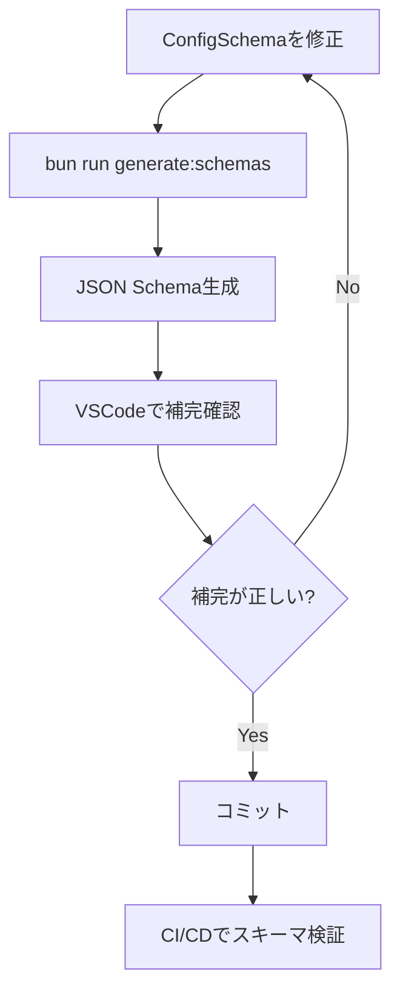

# schema バックエンド設計書

## 1. 技術スタック

| 技術 | バージョン | 用途 |
|------|-----------|------|
| zod | ^3.23.0 | スキーマ定義・実行時検証 |
| zod-to-json-schema | ^3.23.0 | JSON Schema自動生成 |
| Bun | 1.0以上 | スクリプト実行環境 |

### 1.1 技術選定理由

| 技術 | 選定理由 |
|------|---------|
| zod-to-json-schema | zodスキーマとの完全な互換性、型定義との一貫性保証 |

**注意**: Zod v4では`z.toJSONSchema()`がネイティブサポートされますが、現在のプロジェクトはZod v3を使用しているため、`zod-to-json-schema`を採用します。

## 2. スキーマ生成スクリプト

### 2.1 ファイル構成

- `scripts/generate-schemas.ts` - スキーマ生成スクリプト
- `src/core/types.ts` - ConfigSchema定義（既存）
- `config.schema.json` - 生成されるスキーマ
- `orch.schema.json` - 生成されるスキーマ
- `package.json` - npmスクリプト追加

### 2.2 実装詳細

#### scripts/generate-schemas.ts

```typescript
import { zodToJsonSchema } from "zod-to-json-schema";
import { ConfigSchema } from "../src/core/types.js";
import { writeFileSync } from "node:fs";

/**
 * zodスキーマからJSON Schemaを生成する
 */
async function generateSchemas() {
  console.log("📋 JSON Schemaを生成中...");

  // ConfigSchemaをJSON Schemaに変換
  const configSchema = zodToJsonSchema(ConfigSchema, {
    name: "OrchConfig",
    $refStrategy: "none", // 参照を展開（シンプルなスキーマにする）
    target: "jsonSchema7", // JSON Schema Draft 7形式
    definitions: {}, // 共通定義は使用しない
  });

  // メタデータを追加
  const schemaWithMetadata = {
    $schema: "http://json-schema.org/draft-07/schema#",
    title: "Orchestrator Hybrid Configuration",
    description: "orchestrator-hybridの設定ファイルスキーマ",
    ...configSchema,
  };

  // config.schema.json に出力
  writeFileSync(
    "config.schema.json",
    JSON.stringify(schemaWithMetadata, null, 2),
    "utf-8"
  );
  console.log("✅ config.schema.json を生成しました");

  // orch.schema.json に出力（同じ内容）
  writeFileSync(
    "orch.schema.json",
    JSON.stringify(schemaWithMetadata, null, 2),
    "utf-8"
  );
  console.log("✅ orch.schema.json を生成しました");

  console.log("\n💡 VSCodeで補完を有効にするには:");
  console.log("   .vscode/settings.json に以下を追加してください:");
  console.log('   {');
  console.log('     "yaml.schemas": {');
  console.log('       "./config.schema.json": ["config.yml"],');
  console.log('       "./orch.schema.json": ["orch.yml"]');
  console.log('     }');
  console.log('   }');
}

generateSchemas().catch((error) => {
  console.error("❌ スキーマ生成に失敗しました:", error);
  process.exit(1);
});
```

### 2.3 package.json への追加

```json
{
  "scripts": {
    "generate:schemas": "bun run scripts/generate-schemas.ts"
  },
  "dependencies": {
    "zod-to-json-schema": "^3.23.0"
  }
}
```

### 2.4 実行方法

```bash
# スキーマを生成
bun run generate:schemas

# 出力例:
# 📋 JSON Schemaを生成中...
# ✅ config.schema.json を生成しました
# ✅ orch.schema.json を生成しました
#
# 💡 VSCodeで補完を有効にするには:
#    .vscode/settings.json に以下を追加してください:
#    ...
```

## 3. VSCode YAML拡張との連携

### 3.1 設定方法

プロジェクトルートに`.vscode/settings.json`を作成：

```json
{
  "yaml.schemas": {
    "./config.schema.json": ["config.yml"],
    "./orch.schema.json": ["orch.yml"]
  },
  "yaml.format.enable": true,
  "yaml.validate": true
}
```

### 3.2 動作確認

1. VSCodeで`orch.yml`を開く
2. `backend:`と入力
3. `type`のサジェストが表示される
4. `type: `と入力すると`claude`, `opencode`, `gemini`, `container`の候補が表示される

### 3.3 インラインスキーマ指定（オプション）

YAMLファイルの先頭にスキーマを直接指定することも可能：

```yaml
# yaml-language-server: $schema=./orch.schema.json
version: "1.0"
backend:
  type: claude
```

## 4. スキーマ検証機能

### 4.1 既存のvalidateConfig関数の拡張

#### src/core/config.ts

```typescript
import { existsSync, readFileSync } from "node:fs";
import { parse as parseYaml } from "yaml";
import { type Config, ConfigSchema } from "./types.js";
import { ZodError } from "zod";

const DEFAULT_CONFIG_NAME = "orch.yml";

/**
 * 設定ファイルを読み込み、検証する
 * @param configPath 設定ファイルのパス（オプション）
 * @returns 検証済みのConfigオブジェクト
 * @throws 検証エラー時にエラーメッセージを含む例外
 */
export function loadConfig(configPath?: string): Config {
  const path = configPath ?? findConfigFile();

  if (!path) {
    return getDefaultConfig();
  }

  const content = readFileSync(path, "utf-8");
  const raw = parseYaml(content);
  
  // 検証を実行
  return validateConfig(raw, path);
}

/**
 * 設定オブジェクトを検証する
 * @param config 検証対象の設定オブジェクト
 * @param filePath ファイルパス（エラーメッセージ用）
 * @returns 検証済みのConfigオブジェクト
 * @throws 検証エラー時にエラーメッセージを含む例外
 */
export function validateConfig(config: unknown, filePath?: string): Config {
  try {
    return ConfigSchema.parse(config);
  } catch (error) {
    if (error instanceof ZodError) {
      throw new Error(formatValidationError(error, filePath));
    }
    throw error;
  }
}

/**
 * ZodErrorを人間が読みやすい形式に整形する
 * @param error ZodErrorオブジェクト
 * @param filePath ファイルパス（オプション）
 * @returns 整形されたエラーメッセージ
 */
function formatValidationError(error: ZodError, filePath?: string): string {
  const fileInfo = filePath ? `ファイル: ${filePath}\n` : "";
  
  const messages = error.errors.map((err) => {
    const path = err.path.length > 0 ? err.path.join(".") : "root";
    const message = err.message;
    
    // 型エラーの場合は期待される型を表示
    if (err.code === "invalid_type") {
      return `  ❌ ${path}: ${message}\n     期待: ${err.expected}, 実際: ${err.received}`;
    }
    
    // enum エラーの場合は選択肢を表示
    if (err.code === "invalid_enum_value") {
      const options = (err as any).options?.join(", ") || "不明";
      return `  ❌ ${path}: ${message}\n     選択肢: ${options}`;
    }
    
    // その他のエラー
    return `  ❌ ${path}: ${message}`;
  });

  return `設定ファイルの検証に失敗しました:\n${fileInfo}\n${messages.join("\n")}`;
}

function findConfigFile(): string | null {
  const candidates = [DEFAULT_CONFIG_NAME, "orch.yaml", ".orch.yml"];

  for (const candidate of candidates) {
    if (existsSync(candidate)) {
      return candidate;
    }
  }

  return null;
}

function getDefaultConfig(): Config {
  return ConfigSchema.parse({
    version: "1.0",
    backend: { type: "claude" },
    loop: {
      max_iterations: 100,
      completion_promise: "LOOP_COMPLETE",
      idle_timeout_secs: 1800,
    },
  });
}
```

### 4.2 エラーメッセージの例

#### 例1: 不正なenum値

**入力（orch.yml）**:
```yaml
version: "1.0"
backend:
  type: invalid
```

**出力**:
```
設定ファイルの検証に失敗しました:
ファイル: orch.yml

  ❌ backend.type: Invalid enum value. Expected 'claude' | 'opencode' | 'gemini' | 'container', received 'invalid'
     選択肢: claude, opencode, gemini, container
```

#### 例2: 型エラー

**入力（orch.yml）**:
```yaml
version: "1.0"
loop:
  max_iterations: "100"
```

**出力**:
```
設定ファイルの検証に失敗しました:
ファイル: orch.yml

  ❌ loop.max_iterations: Expected number, received string
     期待: number, 実際: string
```

#### 例3: 複数のエラー

**入力（orch.yml）**:
```yaml
version: "1.0"
backend:
  type: invalid
loop:
  max_iterations: "100"
  completion_promise: 123
```

**出力**:
```
設定ファイルの検証に失敗しました:
ファイル: orch.yml

  ❌ backend.type: Invalid enum value. Expected 'claude' | 'opencode' | 'gemini' | 'container', received 'invalid'
     選択肢: claude, opencode, gemini, container
  ❌ loop.max_iterations: Expected number, received string
     期待: number, 実際: string
  ❌ loop.completion_promise: Expected string, received number
     期待: string, 実際: number
```

## 5. 生成されるJSON Schemaの構造

### 5.1 config.schema.json の例

```json
{
  "$schema": "http://json-schema.org/draft-07/schema#",
  "title": "Orchestrator Hybrid Configuration",
  "description": "orchestrator-hybridの設定ファイルスキーマ",
  "type": "object",
  "properties": {
    "version": {
      "type": "string",
      "default": "1.0"
    },
    "backend": {
      "type": "object",
      "properties": {
        "type": {
          "type": "string",
          "enum": ["claude", "opencode", "gemini", "container"],
          "default": "claude"
        },
        "model": {
          "type": "string"
        }
      },
      "required": ["type"],
      "additionalProperties": false
    },
    "container": {
      "type": "object",
      "properties": {
        "enabled": {
          "type": "boolean",
          "default": false
        },
        "image": {
          "type": "string",
          "default": "node:20"
        },
        "env_id": {
          "type": "string"
        }
      },
      "additionalProperties": false
    },
    "loop": {
      "type": "object",
      "properties": {
        "max_iterations": {
          "type": "number",
          "default": 100
        },
        "completion_promise": {
          "type": "string",
          "default": "LOOP_COMPLETE"
        },
        "idle_timeout_secs": {
          "type": "number",
          "default": 1800
        }
      },
      "required": ["max_iterations", "completion_promise", "idle_timeout_secs"],
      "additionalProperties": false
    },
    "hats": {
      "type": "object",
      "additionalProperties": {
        "type": "object",
        "properties": {
          "name": {
            "type": "string"
          },
          "triggers": {
            "type": "array",
            "items": {
              "type": "string"
            }
          },
          "publishes": {
            "type": "array",
            "items": {
              "type": "string"
            }
          },
          "instructions": {
            "type": "string"
          }
        },
        "required": ["triggers", "publishes"],
        "additionalProperties": false
      }
    },
    "gates": {
      "type": "object",
      "properties": {
        "after_plan": {
          "type": "boolean",
          "default": true
        },
        "after_implementation": {
          "type": "boolean",
          "default": false
        },
        "before_pr": {
          "type": "boolean",
          "default": true
        }
      },
      "additionalProperties": false
    },
    "quality": {
      "type": "object",
      "properties": {
        "min_score": {
          "type": "number",
          "default": 8
        },
        "auto_approve_above": {
          "type": "number",
          "default": 9
        }
      },
      "additionalProperties": false
    },
    "state": {
      "type": "object",
      "properties": {
        "use_github_labels": {
          "type": "boolean",
          "default": true
        },
        "use_scratchpad": {
          "type": "boolean",
          "default": true
        },
        "scratchpad_path": {
          "type": "string",
          "default": ".agent/scratchpad.md"
        }
      },
      "additionalProperties": false
    }
  },
  "required": ["version", "backend", "loop"],
  "additionalProperties": false
}
```

## 6. 既存コードとの関係

### 6.1 src/core/types.ts との関係

| 項目 | 説明 |
|------|------|
| **Single Source of Truth** | `ConfigSchema`（zod）が唯一の真実の情報源 |
| **JSON Schemaの位置づけ** | `ConfigSchema`から自動生成される派生物 |
| **手動編集** | JSON Schemaは手動編集禁止、zodスキーマのみ編集 |

### 6.2 変更が必要な既存ファイル

| ファイル | 変更内容 | 影響度 |
|---------|---------|--------|
| `src/core/config.ts` | `validateConfig`関数を追加、`formatValidationError`関数を追加 | 中 |
| `package.json` | `zod-to-json-schema`を依存関係に追加、`generate:schemas`スクリプトを追加 | 小 |

### 6.3 新規作成ファイル

| ファイル | 説明 |
|---------|------|
| `scripts/generate-schemas.ts` | スキーマ生成スクリプト |
| `config.schema.json` | 生成されるJSON Schema（config.yml用） |
| `orch.schema.json` | 生成されるJSON Schema（orch.yml用） |
| `.vscode/settings.json` | VSCode設定（プロジェクトに含めるかは任意） |

## 7. 運用フロー

### 7.1 開発フロー



### 7.2 CI/CDでの検証

**推奨**: CI/CDパイプラインでスキーマが最新かチェック

```bash
# .github/workflows/ci.yml に追加
- name: Check JSON Schema is up-to-date
  run: |
    bun run generate:schemas
    git diff --exit-code config.schema.json orch.schema.json
```

## 8. テスト方針

### 8.1 単体テスト

#### tests/schema-generation.test.ts

```typescript
import { describe, test, expect } from "bun:test";
import { zodToJsonSchema } from "zod-to-json-schema";
import { ConfigSchema } from "../src/core/types.js";

describe("スキーマ生成", () => {
  test("ConfigSchemaからJSON Schemaが生成できる", () => {
    const schema = zodToJsonSchema(ConfigSchema, {
      name: "OrchConfig",
      $refStrategy: "none",
    });

    expect(schema).toBeDefined();
    expect(schema.type).toBe("object");
    expect(schema.properties).toBeDefined();
  });

  test("必須フィールドが正しく設定される", () => {
    const schema = zodToJsonSchema(ConfigSchema, {
      name: "OrchConfig",
      $refStrategy: "none",
    });

    expect(schema.required).toContain("version");
    expect(schema.required).toContain("backend");
    expect(schema.required).toContain("loop");
  });
});
```

#### tests/config-validation.test.ts

```typescript
import { describe, test, expect } from "bun:test";
import { validateConfig } from "../src/core/config.js";

describe("設定ファイル検証", () => {
  test("正しい設定は検証を通過する", () => {
    const config = {
      version: "1.0",
      backend: { type: "claude" },
      loop: {
        max_iterations: 100,
        completion_promise: "LOOP_COMPLETE",
        idle_timeout_secs: 1800,
      },
    };

    expect(() => validateConfig(config)).not.toThrow();
  });

  test("不正なbackend.typeはエラーになる", () => {
    const config = {
      version: "1.0",
      backend: { type: "invalid" },
      loop: {
        max_iterations: 100,
        completion_promise: "LOOP_COMPLETE",
        idle_timeout_secs: 1800,
      },
    };

    expect(() => validateConfig(config)).toThrow(/backend\.type/);
  });

  test("型エラーは適切なメッセージを表示する", () => {
    const config = {
      version: "1.0",
      backend: { type: "claude" },
      loop: {
        max_iterations: "100", // 文字列（エラー）
        completion_promise: "LOOP_COMPLETE",
        idle_timeout_secs: 1800,
      },
    };

    expect(() => validateConfig(config)).toThrow(/Expected number, received string/);
  });
});
```

### 8.2 統合テスト

#### tests/vscode-integration.test.ts（手動テスト）

1. VSCodeで`orch.yml`を開く
2. `backend:`と入力
3. `type`の補完が表示されることを確認
4. `type: `と入力
5. `claude`, `opencode`, `gemini`, `container`の候補が表示されることを確認
6. 不正な値を入力すると波線が表示されることを確認

## 9. README.md への追記内容

以下の内容をREADME.mdに追記することを推奨：

```markdown
## 設定ファイルの補完機能

VSCodeで`orch.yml`を編集する際、自動補完とバリデーションが利用できます。

### セットアップ

1. VSCode YAML拡張をインストール:
   ```bash
   code --install-extension redhat.vscode-yaml
   ```

2. JSON Schemaを生成:
   ```bash
   bun run generate:schemas
   ```

3. `.vscode/settings.json`を作成（プロジェクトに含まれていない場合）:
   ```json
   {
     "yaml.schemas": {
       "./config.schema.json": ["config.yml"],
       "./orch.schema.json": ["orch.yml"]
     }
   }
   ```

### 使い方

- `orch.yml`を編集すると、自動的に補完候補が表示されます
- 不正な値を入力すると、波線でエラーが表示されます
- ホバーすると、各設定項目の説明が表示されます
```

---

## 変更履歴

| 日付 | バージョン | 変更内容 | 担当者 |
|:---|:---|:---|:---|
| 2026-01-24 | 1.0.0 | 初版作成 | AI Assistant |
