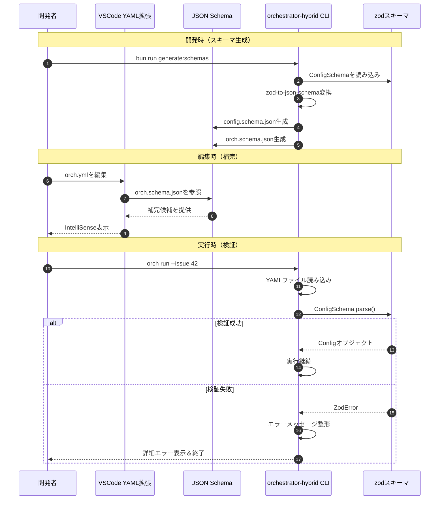

# schema サブ機能 詳細設計書

## メタ情報

| 項目 | 内容 |
|------|------|
| 親機能 | 追加仕様 |
| 含まれる機能ID | F-004, F-005 |
| 関連基本設計書 | BASIC-ORCH-001 |
| 関連要件定義書 | REQ-ORCH-001 |

## 1. 概要

### 1.1 目的

YAML設定ファイル（`orch.yml`, `config.yml`）に対して、VSCodeでの補完機能と起動時の検証機能を提供することで、設定ミスを防ぎ、開発者体験を向上させる。

### 1.2 背景

現在のorchestrator-hybridは、zodスキーマによる実行時検証のみを行っており、以下の課題がある：

- **エディタ補完がない**: YAML編集時に利用可能なオプションが分からない
- **事前検証がない**: 実行してみないとエラーが分からない
- **ドキュメント不足**: 各設定項目の説明がコード内にしかない

### 1.3 処理フロー概要



## 2. 機能要件

### 2.1 対象機能

| 機能ID | 機能名 | 概要 | 優先度 |
|--------|--------|------|--------|
| F-004 | JSON Schema定義 | zodスキーマからJSON Schemaを自動生成 | 必須 |
| F-005 | スキーマ検証機能 | CLI起動時にYAML設定を検証 | 必須 |

### 2.2 ビジネスルール

| ルールID | 内容 |
|---------|------|
| BR-001 | JSON Schemaは`src/core/types.ts`のConfigSchemaから自動生成する |
| BR-002 | スキーマ生成は手動実行（`bun run generate:schemas`）で行う |
| BR-003 | 検証エラーは人間が読みやすい形式で表示する |
| BR-004 | 検証失敗時はCLIを即座に終了する（exitCode=1） |

## 3. 設計書一覧

| 設計書 | パス | 説明 |
|--------|------|------|
| バックエンド設計書 | ./バックエンド設計書.md | スキーマ生成・検証の実装詳細 |

## 4. 共通設計への参照

このサブ機能は独立しており、他の共通設計への依存はありません。

## 5. エラーコード一覧

| コード | HTTPステータス | 説明 |
|--------|---------------|------|
| - | - | CLIツールのためHTTPステータスなし |

**CLI終了コード**:
| 終了コード | 説明 |
|-----------|------|
| 0 | 正常終了 |
| 1 | 設定ファイル検証エラー |

## 6. 関連サブ機能

- [sandbox](../sandbox/詳細設計書.md) - 設定ファイルのsandbox設定を使用
- [logging](../logging/詳細設計書.md) - 設定ファイルのログ設定を使用
- [issue-generator](../issue-generator/詳細設計書.md) - 設定ファイルのautoIssue設定を使用

## 7. 非機能要件

### 7.1 パフォーマンス

| 項目 | 目標値 |
|------|--------|
| スキーマ生成時間 | 1秒以内 |
| 検証処理時間 | 100ms以内 |

### 7.2 保守性

- JSON Schemaは自動生成のため、手動編集禁止
- zodスキーマが唯一の真実の情報源（Single Source of Truth）

### 7.3 互換性

| 項目 | 要件 |
|------|------|
| VSCode YAML拡張 | v1.0.0以上 |
| zod | v3.23.0以上 |
| zod-to-json-schema | v3.23.0以上 |

## 8. テスト方針

### 8.1 単体テスト

| テスト対象 | テストケース |
|-----------|-------------|
| スキーマ生成 | ConfigSchemaから正しいJSON Schemaが生成される |
| 検証成功 | 正しいYAMLファイルが検証を通過する |
| 検証失敗 | 不正なYAMLファイルで適切なエラーが表示される |

### 8.2 統合テスト

| テスト対象 | テストケース |
|-----------|-------------|
| VSCode補完 | orch.yml編集時に補完が表示される |
| CLI起動 | 不正な設定でCLIが起動を拒否する |

### 8.3 テストデータ

```yaml
# 正常系
version: "1.0"
backend:
  type: claude
loop:
  max_iterations: 100

# 異常系1: 不正なbackend.type
version: "1.0"
backend:
  type: invalid  # エラー: "claude" | "opencode" | "gemini" | "container"のみ

# 異常系2: 型エラー
version: "1.0"
loop:
  max_iterations: "100"  # エラー: 数値が必要
```

---

## 変更履歴

| 日付 | バージョン | 変更内容 | 担当者 |
|:---|:---|:---|:---|
| 2026-01-24 | 1.0.0 | 初版作成 | AI Assistant |
