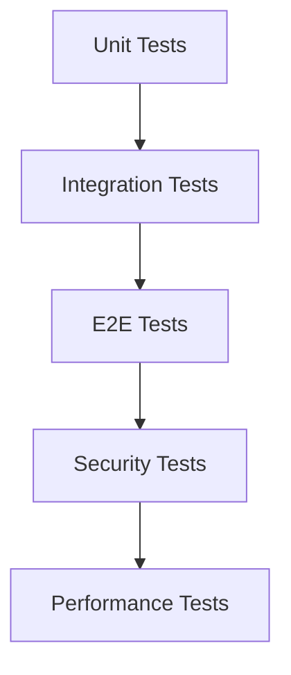

# テスト項目書: orchestrator-hybrid 追加仕様

## メタ情報

| 項目 | 内容 |
|------|------|
| ドキュメントID | TEST-ORCH-001 |
| 対応設計書 | DETAILED-ORCH-001-* (sandbox, schema, logging, issue-generator, common) |
| 作成日 | 2026-01-24 |
| ステータス | ドラフト |
| 対象機能 | F-001〜F-008 |

---

## 1. テスト方針

### 1.1 テストレベル

| レベル | 対象 | カバレッジ目標 |
|--------|------|---------------|
| Unit | ProcessExecutor、各Adapter、IssueGenerator、LogWriter/Streamer | 90%以上 |
| Integration | SandboxFactory、ループエンジン統合、CLI統合 | 80%以上 |
| E2E | 実際のIssue実行、PR作成、ログ監視 | 主要パス100% |

### 1.2 テスト優先度

| 優先度 | 説明 | 実装タイミング |
|--------|------|---------------|
| P0 | クリティカルパス（必須機能） | Sprint 1 |
| P1 | 重要機能（エラーハンドリング等） | Sprint 1-2 |
| P2 | エッジケース（フォールバック等） | Sprint 2以降 |

---

## 2. ユニットテスト項目

### 2.1 ProcessExecutor（F-001, F-002, F-003共通）

#### TC-U-001: BunProcessExecutor - コマンド実行成功

| 項目 | 内容 |
|------|------|
| 優先度 | P0 |
| テスト対象 | BunProcessExecutor.spawn() |
| 前提条件 | - |
| 入力 | command="echo", args=["Hello, World!"] |
| 期待結果 | exitCode=0, stdout="Hello, World!\n", stderr="" |
| 境界値 | - |

**テストコード雛形:**
```typescript
describe('BunProcessExecutor', () => {
  describe('spawn()', () => {
    it('should execute command successfully', async () => {
      // Arrange
      const executor = new BunProcessExecutor();
      
      // Act
      const result = await executor.spawn("echo", ["Hello, World!"]);
      
      // Assert
      expect(result.exitCode).toBe(0);
      expect(result.stdout).toContain("Hello, World!");
      expect(result.stderr).toBe("");
    });
  });
});
```

#### TC-U-002: BunProcessExecutor - タイムアウト

| 項目 | 内容 |
|------|------|
| 優先度 | P0 |
| テスト対象 | BunProcessExecutor.spawn() |
| 前提条件 | - |
| 入力 | command="sleep", args=["10"], options={ timeout: 100 } |
| 期待結果 | ExecutionTimeoutErrorがスローされる |
| 境界値 | timeout=100ms（境界値） |

**テストコード雛形:**
```typescript
it('should timeout long-running command', async () => {
  // Arrange
  const executor = new BunProcessExecutor();
  
  // Act & Assert
  await expect(
    executor.spawn("sleep", ["10"], { timeout: 100 })
  ).rejects.toThrow(ExecutionTimeoutError);
});
```

#### TC-U-003: BunProcessExecutor - 環境変数設定

| 項目 | 内容 |
|------|------|
| 優先度 | P1 |
| テスト対象 | BunProcessExecutor.spawn() |
| 前提条件 | - |
| 入力 | command="printenv", args=["MY_VAR"], options={ env: { MY_VAR: "test_value" } } |
| 期待結果 | stdout="test_value\n" |
| 境界値 | - |

#### TC-U-004: BunProcessExecutor - 標準入力書き込み

| 項目 | 内容 |
|------|------|
| 優先度 | P1 |
| テスト対象 | BunProcessExecutor.spawn() |
| 前提条件 | - |
| 入力 | command="cat", args=[], options={ stdin: "test input" } |
| 期待結果 | stdout="test input" |
| 境界値 | - |

#### TC-U-005: BunProcessExecutor - 存在しないコマンド

| 項目 | 内容 |
|------|------|
| 優先度 | P1 |
| テスト対象 | BunProcessExecutor.spawn() |
| 前提条件 | - |
| 入力 | command="nonexistent-command", args=[] |
| 期待結果 | ProcessExecutionErrorがスローされる |
| 境界値 | - |

---

### 2.2 DockerAdapter（F-001）

#### TC-U-006: DockerAdapter - isAvailable() 成功

| 項目 | 内容 |
|------|------|
| 優先度 | P0 |
| テスト対象 | DockerAdapter.isAvailable() |
| 前提条件 | Dockerがインストール済み |
| 入力 | - |
| 期待結果 | true |
| 境界値 | - |

**テストコード雛形:**
```typescript
describe('DockerAdapter', () => {
  describe('isAvailable()', () => {
    it('should return true when Docker is installed', async () => {
      // Arrange
      const adapter = new DockerAdapter({ image: "node:20-alpine" });
      
      // Act
      const available = await adapter.isAvailable();
      
      // Assert
      expect(available).toBe(true);
    });
  });
});
```

#### TC-U-007: DockerAdapter - isAvailable() 失敗

| 項目 | 内容 |
|------|------|
| 優先度 | P0 |
| テスト対象 | DockerAdapter.isAvailable() |
| 前提条件 | Dockerが未インストール（モック） |
| 入力 | - |
| 期待結果 | false |
| 境界値 | - |

#### TC-U-008: DockerAdapter - execute() 正常系

| 項目 | 内容 |
|------|------|
| 優先度 | P0 |
| テスト対象 | DockerAdapter.execute() |
| 前提条件 | Dockerがインストール済み、イメージが存在 |
| 入力 | command="echo 'Hello from Docker'" |
| 期待結果 | exitCode=0, stdout="Hello from Docker\n" |
| 境界値 | - |

#### TC-U-009: DockerAdapter - イメージpull

| 項目 | 内容 |
|------|------|
| 優先度 | P1 |
| テスト対象 | DockerAdapter.ensureImage() |
| 前提条件 | イメージが存在しない |
| 入力 | image="node:20-alpine" |
| 期待結果 | docker pullが実行され、イメージが取得される |
| 境界値 | - |

#### TC-U-010: DockerAdapter - ネットワーク設定

| 項目 | 内容 |
|------|------|
| 優先度 | P1 |
| テスト対象 | DockerAdapter.buildDockerRunArgs() |
| 前提条件 | - |
| 入力 | network="none" |
| 期待結果 | docker runコマンドに "--network none" が含まれる |
| 境界値 | - |

#### TC-U-011: DockerAdapter - ボリュームマウント

| 項目 | 内容 |
|------|------|
| 優先度 | P0 |
| テスト対象 | DockerAdapter.buildDockerRunArgs() |
| 前提条件 | - |
| 入力 | cwd="/path/to/workdir" |
| 期待結果 | docker runコマンドに "-v /path/to/workdir:/workspace" が含まれる |
| 境界値 | - |

---

### 2.3 HostAdapter（F-002）

#### TC-U-012: HostAdapter - isAvailable()

| 項目 | 内容 |
|------|------|
| 優先度 | P0 |
| テスト対象 | HostAdapter.isAvailable() |
| 前提条件 | - |
| 入力 | - |
| 期待結果 | 常にtrue |
| 境界値 | - |

**テストコード雛形:**
```typescript
describe('HostAdapter', () => {
  describe('isAvailable()', () => {
    it('should always return true', async () => {
      // Arrange
      const adapter = new HostAdapter();
      
      // Act
      const available = await adapter.isAvailable();
      
      // Assert
      expect(available).toBe(true);
    });
  });
});
```

#### TC-U-013: HostAdapter - execute() 正常系

| 項目 | 内容 |
|------|------|
| 優先度 | P0 |
| テスト対象 | HostAdapter.execute() |
| 前提条件 | - |
| 入力 | command="echo 'Hello from Host'" |
| 期待結果 | exitCode=0, stdout="Hello from Host\n" |
| 境界値 | - |

#### TC-U-014: HostAdapter - 初回実行時の警告

| 項目 | 内容 |
|------|------|
| 優先度 | P1 |
| テスト対象 | HostAdapter.execute() |
| 前提条件 | warnOnStart=true |
| 入力 | command="echo test" |
| 期待結果 | 警告ログが出力される |
| 境界値 | - |

#### TC-U-015: HostAdapter - 2回目以降の実行

| 項目 | 内容 |
|------|------|
| 優先度 | P1 |
| テスト対象 | HostAdapter.execute() |
| 前提条件 | 既に1回実行済み |
| 入力 | command="echo test" |
| 期待結果 | 警告ログが出力されない |
| 境界値 | - |

---

### 2.4 SandboxFactory（F-003）

#### TC-U-016: SandboxFactory - プライマリ環境が利用可能

| 項目 | 内容 |
|------|------|
| 優先度 | P0 |
| テスト対象 | SandboxFactory.create() |
| 前提条件 | Dockerがインストール済み |
| 入力 | config={ sandbox: { type: "docker" } } |
| 期待結果 | DockerAdapterが返される |
| 境界値 | - |

**テストコード雛形:**
```typescript
describe('SandboxFactory', () => {
  describe('create()', () => {
    it('should return primary adapter when available', async () => {
      // Arrange
      const config = {
        sandbox: { type: "docker", docker: { image: "node:20-alpine" } }
      };
      
      // Act
      const adapter = await SandboxFactory.create(config);
      
      // Assert
      expect(adapter.name).toBe("docker");
    });
  });
});
```

#### TC-U-017: SandboxFactory - フォールバック

| 項目 | 内容 |
|------|------|
| 優先度 | P0 |
| テスト対象 | SandboxFactory.create() |
| 前提条件 | Dockerが未インストール（モック） |
| 入力 | config={ sandbox: { type: "docker", fallback: "host" } } |
| 期待結果 | HostAdapterが返される、警告ログが出力される |
| 境界値 | - |

#### TC-U-018: SandboxFactory - 全環境が利用不可

| 項目 | 内容 |
|------|------|
| 優先度 | P1 |
| テスト対象 | SandboxFactory.create() |
| 前提条件 | Docker、container-useが未インストール（モック） |
| 入力 | config={ sandbox: { type: "docker", fallback: "container-use" } } |
| 期待結果 | EnvironmentUnavailableErrorがスローされる |
| 境界値 | - |

---

### 2.5 JSON Schema生成（F-004）

#### TC-U-019: スキーマ生成 - ConfigSchemaから正しいJSON Schemaが生成される

| 項目 | 内容 |
|------|------|
| 優先度 | P0 |
| テスト対象 | scripts/generate-schemas.ts |
| 前提条件 | - |
| 入力 | ConfigSchema（zodスキーマ） |
| 期待結果 | config.schema.json、orch.schema.jsonが生成される |
| 境界値 | - |

**テストコード雛形:**
```typescript
describe('スキーマ生成', () => {
  it('should generate JSON Schema from ConfigSchema', () => {
    // Arrange
    const schema = zodToJsonSchema(ConfigSchema, {
      name: "OrchConfig",
      $refStrategy: "none",
    });
    
    // Assert
    expect(schema).toBeDefined();
    expect(schema.type).toBe("object");
    expect(schema.properties).toBeDefined();
  });
});
```

#### TC-U-020: スキーマ生成 - 必須フィールドが正しく設定される

| 項目 | 内容 |
|------|------|
| 優先度 | P0 |
| テスト対象 | zodToJsonSchema() |
| 前提条件 | - |
| 入力 | ConfigSchema |
| 期待結果 | schema.required に "version", "backend", "loop" が含まれる |
| 境界値 | - |

---

### 2.6 スキーマ検証（F-005）

#### TC-U-021: 設定ファイル検証 - 正しい設定は検証を通過

| 項目 | 内容 |
|------|------|
| 優先度 | P0 |
| テスト対象 | validateConfig() |
| 前提条件 | - |
| 入力 | { version: "1.0", backend: { type: "claude" }, loop: { max_iterations: 100, ... } } |
| 期待結果 | エラーがスローされない |
| 境界値 | - |

**テストコード雛形:**
```typescript
describe('設定ファイル検証', () => {
  it('should pass validation for valid config', () => {
    // Arrange
    const config = {
      version: "1.0",
      backend: { type: "claude" },
      loop: {
        max_iterations: 100,
        completion_promise: "LOOP_COMPLETE",
        idle_timeout_secs: 1800,
      },
    };
    
    // Act & Assert
    expect(() => validateConfig(config)).not.toThrow();
  });
});
```

#### TC-U-022: 設定ファイル検証 - 不正なbackend.typeはエラー

| 項目 | 内容 |
|------|------|
| 優先度 | P0 |
| テスト対象 | validateConfig() |
| 前提条件 | - |
| 入力 | { backend: { type: "invalid" }, ... } |
| 期待結果 | ZodErrorがスローされる、エラーメッセージに "backend.type" が含まれる |
| 境界値 | - |

#### TC-U-023: 設定ファイル検証 - 型エラーは適切なメッセージを表示

| 項目 | 内容 |
|------|------|
| 優先度 | P1 |
| テスト対象 | validateConfig() |
| 前提条件 | - |
| 入力 | { loop: { max_iterations: "100" }, ... } |
| 期待結果 | エラーメッセージに "Expected number, received string" が含まれる |
| 境界値 | - |

---

### 2.7 LogWriter（F-008）

#### TC-U-024: LogWriter - initialize() でディレクトリが作成される

| 項目 | 内容 |
|------|------|
| 優先度 | P0 |
| テスト対象 | LogWriter.initialize() |
| 前提条件 | - |
| 入力 | taskId="test-task-123" |
| 期待結果 | .agent/test-task-123/ ディレクトリが作成される |
| 境界値 | - |

**テストコード雛形:**
```typescript
describe('LogWriter', () => {
  describe('initialize()', () => {
    it('should create log directory', async () => {
      // Arrange
      const writer = new LogWriter({ taskId: "test-task-123", baseDir: ".agent-test" });
      
      // Act
      await writer.initialize();
      
      // Assert
      expect(existsSync(writer.getLogDir())).toBe(true);
    });
  });
});
```

#### TC-U-025: LogWriter - writeStdout() で stdout.log と output.log に書き込まれる

| 項目 | 内容 |
|------|------|
| 優先度 | P0 |
| テスト対象 | LogWriter.writeStdout() |
| 前提条件 | initialize()済み |
| 入力 | data="test output\n" |
| 期待結果 | stdout.log と output.log に "test output\n" が書き込まれる |
| 境界値 | - |

#### TC-U-026: LogWriter - writeStderr() で stderr.log と output.log に書き込まれる

| 項目 | 内容 |
|------|------|
| 優先度 | P0 |
| テスト対象 | LogWriter.writeStderr() |
| 前提条件 | initialize()済み |
| 入力 | data="test error\n" |
| 期待結果 | stderr.log と output.log に "test error\n" が書き込まれる |
| 境界値 | - |

#### TC-U-027: LogWriter - initialize() 前に書き込むとエラー

| 項目 | 内容 |
|------|------|
| 優先度 | P1 |
| テスト対象 | LogWriter.writeStdout() |
| 前提条件 | initialize()未実行 |
| 入力 | data="test" |
| 期待結果 | "LogWriter not initialized" エラーがスローされる |
| 境界値 | - |

---

### 2.8 LogStreamer（F-008）

#### TC-U-028: LogStreamer - stream() (follow=false) でファイル全体を読み取る

| 項目 | 内容 |
|------|------|
| 優先度 | P0 |
| テスト対象 | LogStreamer.stream() |
| 前提条件 | output.logに "line1\nline2\nline3\n" が書き込まれている |
| 入力 | follow=false |
| 期待結果 | コールバックが ["line1", "line2", "line3"] で呼ばれる |
| 境界値 | - |

**テストコード雛形:**
```typescript
describe('LogStreamer', () => {
  describe('stream()', () => {
    it('should read entire file when follow=false', async () => {
      // Arrange
      writeFileSync(testLogPath, "line1\nline2\nline3\n");
      const streamer = new LogStreamer({ taskId: "test-task-123", follow: false });
      const lines: string[] = [];
      
      // Act
      await streamer.stream((line) => lines.push(line));
      
      // Assert
      expect(lines).toEqual(["line1", "line2", "line3"]);
    });
  });
});
```

#### TC-U-029: LogStreamer - stream() (follow=true) で新しい行が追加されたら即座にコールバックが呼ばれる

| 項目 | 内容 |
|------|------|
| 優先度 | P0 |
| テスト対象 | LogStreamer.stream() |
| 前提条件 | output.logに "line1\n" が書き込まれている |
| 入力 | follow=true |
| 期待結果 | 初回: ["line1"]、新しい行追加後: ["line1", "line2"] |
| 境界値 | - |

#### TC-U-030: LogStreamer - ファイルが存在しない場合はエラー

| 項目 | 内容 |
|------|------|
| 優先度 | P1 |
| テスト対象 | LogStreamer.stream() |
| 前提条件 | output.logが存在しない |
| 入力 | taskId="non-existent" |
| 期待結果 | "ログファイルが見つかりません" エラーがスローされる |
| 境界値 | - |

---

### 2.9 IssueGenerator（F-006, F-007）

#### TC-U-031: IssueGenerator - 有効な提案からIssueを作成

| 項目 | 内容 |
|------|------|
| 優先度 | P0 |
| テスト対象 | IssueGenerator.createIssues() |
| 前提条件 | gh CLIがインストール済み、enabled=true |
| 入力 | suggestions=[{ title: "Refactor SandboxAdapter", priority: "high", ... }] |
| 期待結果 | Issue URLが返される |
| 境界値 | - |

**テストコード雛形:**
```typescript
describe('IssueGenerator', () => {
  describe('createIssues()', () => {
    it('should create issues for valid suggestions', async () => {
      // Arrange
      const suggestions = [
        {
          title: "Refactor SandboxAdapter",
          description: "High complexity detected",
          priority: "high",
          relatedFiles: ["src/adapters/sandbox-adapter.ts"],
        },
      ];
      const generator = new IssueGenerator(config, mockExecutor);
      
      // Act
      const result = await generator.createIssues(suggestions);
      
      // Assert
      expect(result).toEqual(["https://github.com/owner/repo/issues/123"]);
    });
  });
});
```

#### TC-U-032: IssueGenerator - 優先度が低い提案はスキップ

| 項目 | 内容 |
|------|------|
| 優先度 | P0 |
| テスト対象 | IssueGenerator.createIssues() |
| 前提条件 | minPriority="medium" |
| 入力 | suggestions=[{ title: "Minor typo fix", priority: "low", ... }] |
| 期待結果 | 空配列が返される |
| 境界値 | priority="low"（境界値） |

#### TC-U-033: IssueGenerator - 重複Issueはスキップ

| 項目 | 内容 |
|------|------|
| 優先度 | P1 |
| テスト対象 | IssueGenerator.createIssues() |
| 前提条件 | 同じタイトルのIssueが既に存在 |
| 入力 | suggestions=[{ title: "Existing Issue", ... }] |
| 期待結果 | 空配列が返される |
| 境界値 | - |

#### TC-U-034: IssueGenerator - enabled=false の場合は空配列を返す

| 項目 | 内容 |
|------|------|
| 優先度 | P0 |
| テスト対象 | IssueGenerator.createIssues() |
| 前提条件 | enabled=false |
| 入力 | suggestions=[{ title: "Test", ... }] |
| 期待結果 | 空配列が返される |
| 境界値 | - |

---

### 2.10 improvement-extractor（F-006）

#### TC-U-035: extractFromScratchpad - マーカー付き改善提案を正しく抽出

| 項目 | 内容 |
|------|------|
| 優先度 | P0 |
| テスト対象 | extractFromScratchpad() |
| 前提条件 | Scratchpadに改善提案マーカーが含まれる |
| 入力 | scratchpad内容（マーカー付き） |
| 期待結果 | ImprovementSuggestion配列が返される |
| 境界値 | - |

**テストコード雛形:**
```typescript
describe('extractImprovements', () => {
  it('should extract improvement suggestions from scratchpad', async () => {
    // Arrange
    const scratchpadContent = `
<!-- IMPROVEMENT_START priority:high category:refactoring -->
**タイトル**: SandboxAdapterの循環的複雑度が高い
**説明**: DockerAdapterのbuildDockerRunArgsメソッドが100行を超えています。
**関連ファイル**:
- \`src/adapters/docker-adapter.ts\`
<!-- IMPROVEMENT_END -->
    `;
    writeFileSync(scratchpadPath, scratchpadContent);
    
    // Act
    const suggestions = await extractImprovements(context);
    
    // Assert
    expect(suggestions).toHaveLength(1);
    expect(suggestions[0].title).toBe("SandboxAdapterの循環的複雑度が高い");
    expect(suggestions[0].priority).toBe("high");
  });
});
```

#### TC-U-036: extractFromScratchpad - マーカーなしの場合は空配列を返す

| 項目 | 内容 |
|------|------|
| 優先度 | P1 |
| テスト対象 | extractFromScratchpad() |
| 前提条件 | Scratchpadに改善提案マーカーが含まれない |
| 入力 | scratchpad内容（通常のメモのみ） |
| 期待結果 | 空配列が返される |
| 境界値 | - |

---

## 3. 統合テスト項目

### 3.1 Sandbox統合テスト

#### TC-I-001: Docker環境でのループ実行

| 項目 | 内容 |
|------|------|
| 優先度 | P0 |
| エンドポイント | - |
| 前提条件 | Dockerがインストール済み、config.sandbox.type="docker" |
| リクエスト | orch run --issue 42 --auto |
| 期待ステータス | 正常終了（exitCode=0） |
| 期待レスポンス | Issue #42 が完了する |
| DB確認 | - |

**テストコード雛形:**
```typescript
describe('Sandbox統合テスト', () => {
  it('should execute loop in Docker environment', async () => {
    // Arrange
    const config = {
      sandbox: { type: "docker", docker: { image: "node:20-alpine" } }
    };
    
    // Act
    const result = await runLoop({ issueNumber: 42, config });
    
    // Assert
    expect(result.completionReason).toBe("completed");
  });
});
```

#### TC-I-002: ホスト環境でのループ実行

| 項目 | 内容 |
|------|------|
| 優先度 | P0 |
| エンドポイント | - |
| 前提条件 | config.sandbox.type="host" |
| リクエスト | orch run --issue 42 --auto |
| 期待ステータス | 正常終了（exitCode=0） |
| 期待レスポンス | Issue #42 が完了する、警告ログが出力される |
| DB確認 | - |

#### TC-I-003: フォールバック動作

| 項目 | 内容 |
|------|------|
| 優先度 | P1 |
| エンドポイント | - |
| 前提条件 | Dockerが未インストール、config.sandbox.fallback="host" |
| リクエスト | orch run --issue 42 --auto |
| 期待ステータス | 正常終了（exitCode=0） |
| 期待レスポンス | HostAdapterで実行される、フォールバック警告が出力される |
| DB確認 | - |

#### TC-I-004: タイムアウト処理

| 項目 | 内容 |
|------|------|
| 優先度 | P1 |
| エンドポイント | - |
| 前提条件 | config.sandbox.docker.timeout=5（秒） |
| リクエスト | 長時間実行されるコマンド |
| 期待ステータス | タイムアウトエラー |
| 期待レスポンス | ExecutionTimeoutErrorがスローされる |
| DB確認 | - |

---

### 3.2 Schema統合テスト

#### TC-I-005: VSCode補完動作確認（手動テスト）

| 項目 | 内容 |
|------|------|
| 優先度 | P1 |
| エンドポイント | - |
| 前提条件 | VSCode YAML拡張がインストール済み、.vscode/settings.jsonが設定済み |
| リクエスト | orch.ymlを編集 |
| 期待ステータス | - |
| 期待レスポンス | backend.type入力時に補完候補が表示される |
| DB確認 | - |

#### TC-I-006: CLI起動時のスキーマ検証

| 項目 | 内容 |
|------|------|
| 優先度 | P0 |
| エンドポイント | - |
| 前提条件 | orch.ymlに不正な設定が含まれる |
| リクエスト | orch run --issue 42 |
| 期待ステータス | エラー終了（exitCode=1） |
| 期待レスポンス | 詳細なエラーメッセージが表示される |
| DB確認 | - |

---

### 3.3 Logging統合テスト

#### TC-I-007: ループ実行中のログ記録

| 項目 | 内容 |
|------|------|
| 優先度 | P0 |
| エンドポイント | - |
| 前提条件 | - |
| リクエスト | orch run --issue 42 --auto |
| 期待ステータス | 正常終了 |
| 期待レスポンス | .agent/task-*/output.log にログが記録される |
| DB確認 | - |

#### TC-I-008: ログのリアルタイム監視

| 項目 | 内容 |
|------|------|
| 優先度 | P0 |
| エンドポイント | - |
| 前提条件 | タスクが実行中 |
| リクエスト | orch logs -t <task-id> -f |
| 期待ステータス | - |
| 期待レスポンス | 新しいログが即座に表示される |
| DB確認 | - |

#### TC-I-009: 並列タスクのログ分離

| 項目 | 内容 |
|------|------|
| 優先度 | P1 |
| エンドポイント | - |
| 前提条件 | 複数タスクが並列実行中 |
| リクエスト | orch logs -t <task-id-1> |
| 期待ステータス | - |
| 期待レスポンス | task-id-1のログのみが表示される |
| DB確認 | - |

---

### 3.4 IssueGenerator統合テスト

#### TC-I-010: ループ完了後のIssue作成

| 項目 | 内容 |
|------|------|
| 優先度 | P0 |
| エンドポイント | - |
| 前提条件 | config.autoIssue.enabled=true、Scratchpadに改善提案マーカーあり |
| リクエスト | orch run --issue 42 --auto |
| 期待ステータス | 正常終了 |
| 期待レスポンス | 改善提案がGitHub Issueとして作成される |
| DB確認 | - |

#### TC-I-011: autoIssue.enabled=false の場合

| 項目 | 内容 |
|------|------|
| 優先度 | P0 |
| エンドポイント | - |
| 前提条件 | config.autoIssue.enabled=false |
| リクエスト | orch run --issue 42 --auto |
| 期待ステータス | 正常終了 |
| 期待レスポンス | Issueが作成されない |
| DB確認 | - |

#### TC-I-012: 重複Issue検出

| 項目 | 内容 |
|------|------|
| 優先度 | P1 |
| エンドポイント | - |
| 前提条件 | 同じタイトルのIssueが既に存在 |
| リクエスト | orch run --issue 42 --auto |
| 期待ステータス | 正常終了 |
| 期待レスポンス | 重複Issueが作成されない、ログに "重複のためスキップ" が出力される |
| DB確認 | - |

#### TC-I-013: gh CLI未インストール

| 項目 | 内容 |
|------|------|
| 優先度 | P1 |
| エンドポイント | - |
| 前提条件 | gh CLIが未インストール |
| リクエスト | orch run --issue 42 --auto |
| 期待ステータス | 正常終了 |
| 期待レスポンス | 警告ログが出力される、ループは正常完了 |
| DB確認 | - |

---

## 4. E2Eテスト項目

### 4.1 ユーザーフロー: Issue実行からPR作成まで

#### TC-E-001: 完全自動実行（Docker環境）

| 項目 | 内容 |
|------|------|
| 優先度 | P0 |
| 前提条件 | Dockerがインストール済み、GitHub認証済み |
| 手順 | 1. `orch run --issue 42 --auto --create-pr`<br>2. ループ完了を待機<br>3. PRが作成されることを確認 |
| 期待結果 | 1. ループが正常完了<br>2. PRが作成される<br>3. ログが記録される |
| スクリーンショット | - |

#### TC-E-002: 承認ゲート付き実行

| 項目 | 内容 |
|------|------|
| 優先度 | P1 |
| 前提条件 | - |
| 手順 | 1. `orch run --issue 42`<br>2. Pre-Loop承認ゲートで "continue" を入力<br>3. Post-Completion承認ゲートで "continue" を入力 |
| 期待結果 | 1. 各承認ゲートで一時停止<br>2. 承認後にループが継続<br>3. 正常完了 |
| スクリーンショット | - |

#### TC-E-003: ログのリアルタイム監視

| 項目 | 内容 |
|------|------|
| 優先度 | P1 |
| 前提条件 | タスクが実行中 |
| 手順 | 1. ターミナル1: `orch run --issue 42 --auto`<br>2. ターミナル2: `orch logs -t <task-id> -f`<br>3. ターミナル2でログが表示されることを確認 |
| 期待結果 | 1. ターミナル2でリアルタイムにログが表示される<br>2. Ctrl+Cで監視を停止できる |
| スクリーンショット | - |

#### TC-E-004: 改善Issue自動作成

| 項目 | 内容 |
|------|------|
| 優先度 | P1 |
| 前提条件 | config.autoIssue.enabled=true、Scratchpadに改善提案マーカーあり |
| 手順 | 1. Scratchpadに改善提案マーカーを追加<br>2. `orch run --issue 42 --auto`<br>3. GitHubで新しいIssueが作成されることを確認 |
| 期待結果 | 1. ループ完了後にIssueが作成される<br>2. Issue本文に改善提案の内容が含まれる<br>3. ラベルが自動付与される |
| スクリーンショット | - |

---

## 5. エッジケース・境界値テスト

### 5.1 入力値の境界

| TC-ID | 対象 | 境界条件 | テスト値 | 期待結果 |
|-------|------|---------|---------|---------|
| TC-B-001 | timeout | 最小値 | 1ms | タイムアウトが機能する |
| TC-B-002 | timeout | 最大値 | 3600000ms（1時間） | タイムアウトが機能する |
| TC-B-003 | max_iterations | 最小値 | 1 | 1回で完了 |
| TC-B-004 | max_iterations | 最大値 | 1000 | 1000回まで実行可能 |
| TC-B-005 | minPriority | high | high | highのみ作成 |
| TC-B-006 | minPriority | low | low | すべて作成 |

### 5.2 特殊ケース

| TC-ID | ケース | 入力 | 期待結果 |
|-------|--------|------|---------|
| TC-S-001 | 空のScratchpad | "" | 改善提案が抽出されない |
| TC-S-002 | 不正なマーカー | `<!-- IMPROVEMENT_START -->` のみ | パースエラー、警告ログ出力 |
| TC-S-003 | 特殊文字を含むタイトル | `"Refactor <script>alert('XSS')</script>"` | エスケープされる |
| TC-S-004 | 長いログファイル | 10MB以上のログ | 正常に読み取れる |

---

## 6. セキュリティテスト項目

| TC-ID | テスト観点 | テスト内容 | 期待結果 |
|-------|-----------|-----------|---------|
| TC-SEC-001 | コマンドインジェクション | Issue本文に `; rm -rf /` を含める | エスケープされる、実行されない |
| TC-SEC-002 | パストラバーサル | taskId="../../../etc/passwd" | エラーがスローされる |
| TC-SEC-003 | Docker隔離 | network="none"でネットワークアクセス試行 | ネットワークアクセスが拒否される |
| TC-SEC-004 | ホスト環境警告 | ホスト環境で実行 | 警告が表示される |

---

## 7. パフォーマンステスト項目

| TC-ID | テスト対象 | 条件 | 目標値 |
|-------|-----------|------|--------|
| TC-P-001 | スキーマ生成 | ConfigSchemaから生成 | 1秒以内 |
| TC-P-002 | スキーマ検証 | orch.yml検証 | 100ms以内 |
| TC-P-003 | ログ書き込み | 1000行書き込み | 1秒以内 |
| TC-P-004 | ログ読み取り | 10MBファイル読み取り | 2秒以内 |
| TC-P-005 | Issue作成 | 10件のIssue作成 | 15秒以内 |

---

## 8. テストデータ

### 8.1 正常系テストデータ

```yaml
# orch.yml（正常系）
version: "1.0"
backend:
  type: claude
sandbox:
  type: docker
  fallback: host
  docker:
    image: node:20-alpine
    network: none
    timeout: 300
autoIssue:
  enabled: true
  minPriority: medium
  labels:
    - auto-generated
    - improvement
```

### 8.2 異常系テストデータ

```yaml
# orch.yml（異常系1: 不正なbackend.type）
version: "1.0"
backend:
  type: invalid  # エラー

# orch.yml（異常系2: 型エラー）
version: "1.0"
loop:
  max_iterations: "100"  # エラー: 数値が必要
```

### 8.3 Scratchpad改善提案マーカー

```markdown
<!-- IMPROVEMENT_START priority:high category:refactoring -->
**タイトル**: SandboxAdapterの循環的複雑度が高い

**説明**: 
DockerAdapterのbuildDockerRunArgsメソッドが100行を超えており、
テストが困難になっています。

**関連ファイル**:
- `src/adapters/docker-adapter.ts`

**提案アクション**:
1. コマンド構築ロジックを小さな関数に分割
2. ビルダーパターンの導入を検討
<!-- IMPROVEMENT_END -->
```

---

## 9. テスト実行順序



---

## 10. カバレッジ目標

| レイヤー | 目標カバレッジ | 備考 |
|---------|--------------|------|
| ProcessExecutor | 95% | プロセス実行は高カバレッジ必須 |
| Adapter（Docker/Host/Container） | 90% | 環境依存処理は高カバレッジ必須 |
| IssueGenerator | 90% | Issue作成ロジックは高カバレッジ必須 |
| LogWriter/Streamer | 85% | ファイルI/Oは高カバレッジ必須 |
| Schema生成・検証 | 80% | 設定検証は重要 |
| CLI統合 | 70% | E2Eでカバー |

---

## 変更履歴

| 日付 | バージョン | 変更内容 | 担当者 |
|:---|:---|:---|:---|
| 2026-01-24 | 1.0.0 | 初版作成 | AI Assistant |
