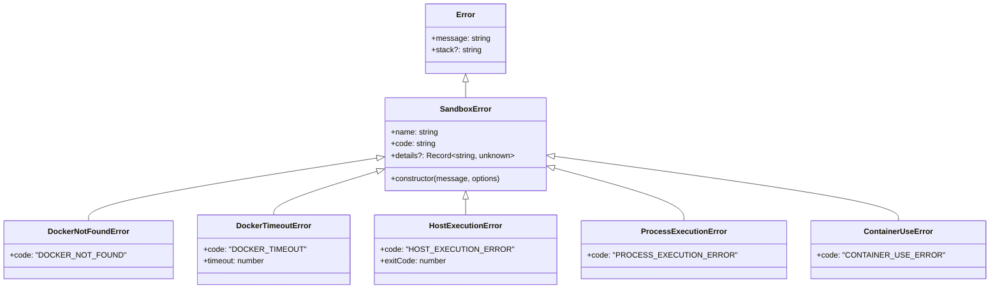
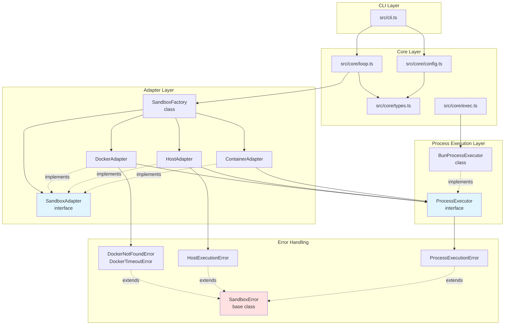

# 型定義・共通処理設計書

## メタ情報

| 項目 | 内容 |
|------|------|
| ドキュメントID | DETAILED-ORCH-001-COMMON |
| バージョン | 1.0.0 |
| ステータス | ドラフト |
| 作成日 | 2026-01-24 |
| 最終更新日 | 2026-01-24 |
| 作成者 | AI Assistant |
| 承認者 | - |
| 関連基本設計書 | BASIC-ORCH-001 v1.0.0 |
| 対象機能 | 全機能（F-001～F-008） |

---

## 1. 概要

### 1.1 目的

orchestrator-hybrid追加仕様における共通的な型定義とエラーハンドリングパターンを定義します。特に以下の点に注力します：

- **ProcessExecutor抽象化**: Bun.spawnへの直接依存を排除し、将来のランタイム切り替えを容易にする
- **型安全性の向上**: zodスキーマによる実行時検証とTypeScript型定義の統合
- **エラーハンドリングの統一**: 各アダプターで共通のエラー処理パターンを適用

### 1.2 スコープ

#### スコープ内

- ProcessExecutor インターフェース定義
- BunProcessExecutor 実装仕様
- SpawnOptions, ProcessResult 型定義
- src/core/types.ts への追加型定義（SandboxConfigSchema, AutoIssueConfigSchema等）
- LoopContext 拡張（taskId追加）
- エラーハンドリング共通パターン（SandboxError基底クラス等）
- 既存exec.tsとの互換性維持方法

#### スコープ外

- 個別アダプター（Docker/Host/Container）の詳細実装
- ログ管理システムの詳細実装
- Issue生成ロジックの詳細実装

### 1.3 参照ドキュメント

| ドキュメント | パス | 参照箇所 |
|-------------|------|---------|
| 基本設計書 | docs/designs/basic/BASIC-ORCH-001_追加仕様.md | セクション4.1（ProcessExecutor抽象化） |
| 要件定義書 | docs/requirements/REQ-ORCH-001_追加仕様.md | 全機能要件 |
| 既存型定義 | src/core/types.ts | 既存スキーマ定義 |
| 既存exec実装 | src/core/exec.ts | 既存プロセス実行関数 |

---

## 2. ProcessExecutor抽象化

### 2.1 設計方針

#### 目的

- **Bun.spawnへの直接依存を排除**: 将来のNode.js対応を容易にする
- **テスト容易性の向上**: モック化が簡単になる
- **統一インターフェース**: 全アダプターで同じプロセス実行APIを使用

#### 設計原則

| 原則 | 説明 |
|------|------|
| **単一責任** | プロセス実行のみに責務を限定 |
| **依存性逆転** | 具体的な実装（Bun.spawn）ではなく、抽象（interface）に依存 |
| **オープン・クローズド** | 拡張に開かれ、修正に閉じている |

### 2.2 インターフェース定義

#### SpawnOptions型

```typescript
/**
 * プロセス実行オプション
 */
export interface SpawnOptions {
  /**
   * 作業ディレクトリ
   * @default process.cwd()
   */
  cwd?: string;

  /**
   * 環境変数
   * @default process.env
   */
  env?: Record<string, string>;

  /**
   * 標準入力に書き込むデータ
   */
  stdin?: string;

  /**
   * タイムアウト（ミリ秒）
   * @default undefined（無制限）
   */
  timeout?: number;

  /**
   * 標準出力の処理方法
   * - "pipe": パイプで取得（デフォルト）
   * - "inherit": 親プロセスの標準出力に出力
   */
  stdout?: "pipe" | "inherit";

  /**
   * 標準エラー出力の処理方法
   * - "pipe": パイプで取得（デフォルト）
   * - "inherit": 親プロセスの標準エラー出力に出力
   */
  stderr?: "pipe" | "inherit";
}
```

#### ProcessResult型

```typescript
/**
 * プロセス実行結果
 */
export interface ProcessResult {
  /**
   * 標準出力
   * stdout="inherit"の場合は空文字列
   */
  stdout: string;

  /**
   * 標準エラー出力
   * stderr="inherit"の場合は空文字列
   */
  stderr: string;

  /**
   * 終了コード
   * 0: 正常終了
   * 非0: エラー終了
   */
  exitCode: number;
}
```

#### ProcessExecutorインターフェース

```typescript
/**
 * プロセス実行を抽象化するインターフェース
 * 
 * 実装クラス:
 * - BunProcessExecutor: Bun.spawnを使用
 * - (将来) NodeProcessExecutor: child_processを使用
 */
export interface ProcessExecutor {
  /**
   * コマンドを実行する
   * 
   * @param command 実行するコマンド（例: "docker", "gh"）
   * @param args コマンド引数の配列
   * @param options 実行オプション
   * @returns 実行結果のPromise
   * @throws ProcessExecutionError タイムアウトまたは実行失敗時
   * 
   * @example
   * ```typescript
   * const executor = new BunProcessExecutor();
   * const result = await executor.spawn("echo", ["hello"], {
   *   timeout: 5000,
   * });
   * console.log(result.stdout); // "hello\n"
   * ```
   */
  spawn(
    command: string,
    args: string[],
    options?: SpawnOptions
  ): Promise<ProcessResult>;
}
```

### 2.3 BunProcessExecutor実装仕様

#### クラス構造

```typescript
/**
 * Bun.spawnを使用したProcessExecutor実装
 */
export class BunProcessExecutor implements ProcessExecutor {
  /**
   * コマンドを実行する
   */
  async spawn(
    command: string,
    args: string[],
    options: SpawnOptions = {}
  ): Promise<ProcessResult>;

  /**
   * タイムアウト処理を設定
   * @private
   */
  private setupTimeout(
    proc: Subprocess,
    timeout: number
  ): NodeJS.Timeout;

  /**
   * 標準入力にデータを書き込む
   * @private
   */
  private async writeStdin(
    proc: Subprocess,
    data: string
  ): Promise<void>;
}
```

#### 実装詳細

##### spawn()メソッド

```typescript
async spawn(
  command: string,
  args: string[],
  options: SpawnOptions = {}
): Promise<ProcessResult> {
  // 1. Bun.spawnを呼び出し
  const proc = Bun.spawn([command, ...args], {
    cwd: options.cwd,
    env: options.env,
    stdin: options.stdin ? "pipe" : undefined,
    stdout: options.stdout ?? "pipe",
    stderr: options.stderr ?? "pipe",
  });

  // 2. タイムアウト処理を設定
  let timeoutId: NodeJS.Timeout | undefined;
  if (options.timeout) {
    timeoutId = this.setupTimeout(proc, options.timeout);
  }

  // 3. 標準入力にデータを書き込む
  if (options.stdin && proc.stdin) {
    await this.writeStdin(proc, options.stdin);
  }

  // 4. 実行完了を待機
  try {
    const [stdout, stderr, exitCode] = await Promise.all([
      options.stdout === "inherit" 
        ? Promise.resolve("") 
        : new Response(proc.stdout).text(),
      options.stderr === "inherit" 
        ? Promise.resolve("") 
        : new Response(proc.stderr).text(),
      proc.exited,
    ]);

    // 5. タイムアウトタイマーをクリア
    if (timeoutId) {
      clearTimeout(timeoutId);
    }

    return { stdout, stderr, exitCode };
  } catch (error) {
    // 6. エラーハンドリング
    if (timeoutId) {
      clearTimeout(timeoutId);
    }
    throw new ProcessExecutionError(
      `Failed to execute command: ${command}`,
      { cause: error }
    );
  }
}
```

##### setupTimeout()メソッド

```typescript
private setupTimeout(
  proc: Subprocess,
  timeout: number
): NodeJS.Timeout {
  const timeoutId = setTimeout(() => {
    proc.kill();
  }, timeout);

  // プロセス終了時にタイマーをクリア
  proc.exited.then(() => clearTimeout(timeoutId));

  return timeoutId;
}
```

##### writeStdin()メソッド

```typescript
private async writeStdin(
  proc: Subprocess,
  data: string
): Promise<void> {
  if (!proc.stdin) {
    throw new ProcessExecutionError(
      "stdin is not available"
    );
  }

  const writer = proc.stdin.getWriter();
  try {
    await writer.write(new TextEncoder().encode(data));
    await writer.close();
  } catch (error) {
    throw new ProcessExecutionError(
      "Failed to write to stdin",
      { cause: error }
    );
  }
}
```

### 2.4 既存exec.tsとの互換性

#### 移行戦略

| フェーズ | 内容 | 期間 |
|---------|------|------|
| **Phase 1** | ProcessExecutorを新規実装、既存exec.tsは維持 | 1週間 |
| **Phase 2** | 新規コードでProcessExecutorを使用開始 | 1週間 |
| **Phase 3** | 既存コードを段階的にProcessExecutorに移行 | 2週間 |
| **Phase 4** | exec.tsを非推奨化（deprecate） | - |

#### 互換性レイヤー

既存のexec()関数をProcessExecutorでラップすることで、既存コードへの影響を最小化します。

```typescript
// src/core/exec.ts（既存ファイルを拡張）

import { BunProcessExecutor } from "./bun-process-executor.js";
import type { ProcessExecutor } from "./process-executor.js";

// デフォルトのexecutorインスタンス
const defaultExecutor: ProcessExecutor = new BunProcessExecutor();

/**
 * 既存のexec関数（互換性のため維持）
 * @deprecated ProcessExecutorを直接使用してください
 */
export async function exec(
  cmd: string,
  args: string[],
  options: ExecOptions = {}
): Promise<ExecResult> {
  const { reject = true } = options;

  try {
    const result = await defaultExecutor.spawn(cmd, args);

    if (reject && result.exitCode !== 0) {
      throw new Error(
        `Command failed with exit code ${result.exitCode}: ${result.stderr || result.stdout}`
      );
    }

    return {
      stdout: result.stdout,
      exitCode: result.exitCode,
    };
  } catch (error) {
    if (reject) {
      throw error;
    }
    return {
      stdout: "",
      exitCode: 1,
    };
  }
}

/**
 * ProcessExecutorインスタンスを取得
 * 新規コードではこちらを使用してください
 */
export function getProcessExecutor(): ProcessExecutor {
  return defaultExecutor;
}
```

#### 移行ガイドライン

##### 既存コードの例

```typescript
// 既存コード
import { exec } from "./core/exec.js";

const result = await exec("docker", ["--version"]);
console.log(result.stdout);
```

##### 新規コードの例

```typescript
// 新規コード
import { getProcessExecutor } from "./core/exec.js";

const executor = getProcessExecutor();
const result = await executor.spawn("docker", ["--version"]);
console.log(result.stdout);
```

---

## 3. 型定義拡張（src/core/types.ts）

### 3.1 SandboxConfigSchema

```typescript
/**
 * サンドボックス設定のzodスキーマ
 */
export const SandboxConfigSchema = z.object({
  /**
   * サンドボックスタイプ
   * - docker: Dockerコンテナ
   * - container-use: container-use環境
   * - host: ホスト環境（隔離なし）
   */
  type: z.enum(["docker", "container-use", "host"]).default("container-use"),

  /**
   * フォールバック先のサンドボックスタイプ
   * プライマリが利用できない場合に使用
   */
  fallback: z.enum(["docker", "container-use", "host"]).optional(),

  /**
   * Docker設定
   */
  docker: z.object({
    /**
     * Dockerイメージ名
     * @example "node:20-alpine"
     */
    image: z.string().default("node:20-alpine"),

    /**
     * ネットワークモード
     * - none: ネットワーク無効（最も安全）
     * - bridge: ブリッジネットワーク
     * - host: ホストネットワーク
     */
    network: z.enum(["none", "bridge", "host"]).optional(),

    /**
     * タイムアウト（秒）
     */
    timeout: z.number().default(300),
  }).optional(),

  /**
   * container-use設定（既存）
   */
  containerUse: z.object({
    image: z.string().optional(),
    envId: z.string().optional(),
  }).optional(),

  /**
   * ホスト環境設定
   */
  host: z.object({
    /**
     * タイムアウト（秒）
     */
    timeout: z.number().default(300),

    /**
     * 初回実行時に警告を表示するか
     */
    warnOnStart: z.boolean().default(true),
  }).optional(),
});

export type SandboxConfig = z.infer<typeof SandboxConfigSchema>;
```

### 3.2 AutoIssueConfigSchema

```typescript
/**
 * 改善Issue自動作成設定のzodスキーマ
 */
export const AutoIssueConfigSchema = z.object({
  /**
   * Issue自動作成を有効にするか
   */
  enabled: z.boolean().default(false),

  /**
   * Issue作成する最低優先度
   * - high: 高優先度のみ
   * - medium: 中優先度以上
   * - low: すべて
   */
  minPriority: z.enum(["high", "medium", "low"]).default("medium"),

  /**
   * 自動作成されたIssueに付与するラベル
   */
  labels: z.array(z.string()).default(["auto-generated", "improvement"]),

  /**
   * リポジトリ（オプション）
   * 指定しない場合は現在のリポジトリ
   * @example "owner/repo"
   */
  repository: z.string().optional(),
});

export type AutoIssueConfig = z.infer<typeof AutoIssueConfigSchema>;
```

### 3.3 ConfigSchema拡張

```typescript
/**
 * 設定ファイル全体のzodスキーマ（拡張版）
 */
export const ConfigSchema = z.object({
  version: z.string().default("1.0"),

  backend: z.object({
    type: z.enum(["claude", "opencode", "gemini", "container"]).default("claude"),
    model: z.string().optional(),
  }),

  // 既存のcontainer設定は維持
  container: ContainerConfigSchema,

  // 新規: sandbox設定
  sandbox: SandboxConfigSchema.optional(),

  loop: z.object({
    max_iterations: z.number().default(100),
    completion_promise: z.string().default("LOOP_COMPLETE"),
    idle_timeout_secs: z.number().default(1800),
  }),

  hats: z.record(z.string(), HatSchema).optional(),

  gates: z.object({
    after_plan: z.boolean().default(true),
    after_implementation: z.boolean().default(false),
    before_pr: z.boolean().default(true),
  }).optional(),

  quality: z.object({
    min_score: z.number().default(8),
    auto_approve_above: z.number().default(9),
  }).optional(),

  state: z.object({
    use_github_labels: z.boolean().default(true),
    use_scratchpad: z.boolean().default(true),
    scratchpad_path: z.string().default(".agent/scratchpad.md"),
  }).optional(),

  // 新規: 改善Issue自動作成設定
  autoIssue: AutoIssueConfigSchema.optional(),
});

export type Config = z.infer<typeof ConfigSchema>;
```

### 3.4 LoopContext拡張

```typescript
/**
 * ループ実行コンテキスト（拡張版）
 */
export interface LoopContext {
  // 既存フィールド
  issue: Issue;
  iteration: number;
  maxIterations: number;
  scratchpadPath: string;
  promptPath: string;
  completionPromise: string;
  autoMode: boolean;
  createPR: boolean;
  draftPR: boolean;
  useContainer: boolean;
  generateReport: boolean;
  reportPath: string;
  preset?: string;

  // 新規: タスクID（並列実行対応）
  /**
   * タスクID
   * 並列実行時に各タスクを一意に識別するためのID
   * @example "task-1737705600000-42"
   */
  taskId: string;

  // 新規: ログディレクトリ
  /**
   * ログディレクトリパス
   * @example ".agent/task-1737705600000-42"
   */
  logDir: string;
}
```

---

## 4. エラーハンドリング共通パターン

### 4.1 エラークラス階層



### 4.2 SandboxError基底クラス

```typescript
/**
 * サンドボックス関連エラーの基底クラス
 */
export class SandboxError extends Error {
  /**
   * エラーコード
   */
  readonly code: string;

  /**
   * 追加の詳細情報
   */
  readonly details?: Record<string, unknown>;

  constructor(
    message: string,
    options?: {
      code?: string;
      details?: Record<string, unknown>;
      cause?: unknown;
    }
  ) {
    super(message, { cause: options?.cause });
    this.name = "SandboxError";
    this.code = options?.code ?? "SANDBOX_ERROR";
    this.details = options?.details;

    // スタックトレースを適切に設定
    if (Error.captureStackTrace) {
      Error.captureStackTrace(this, this.constructor);
    }
  }

  /**
   * エラー情報をJSON形式で取得
   */
  toJSON(): Record<string, unknown> {
    return {
      name: this.name,
      code: this.code,
      message: this.message,
      details: this.details,
      stack: this.stack,
    };
  }
}
```

### 4.3 個別エラークラス

#### DockerNotFoundError

```typescript
/**
 * Dockerが見つからない場合のエラー
 */
export class DockerNotFoundError extends SandboxError {
  constructor(message = "Docker is not installed or not in PATH") {
    super(message, {
      code: "DOCKER_NOT_FOUND",
    });
    this.name = "DockerNotFoundError";
  }
}
```

#### DockerTimeoutError

```typescript
/**
 * Docker実行がタイムアウトした場合のエラー
 */
export class DockerTimeoutError extends SandboxError {
  readonly timeout: number;

  constructor(timeout: number) {
    super(`Docker execution timed out after ${timeout}ms`, {
      code: "DOCKER_TIMEOUT",
      details: { timeout },
    });
    this.name = "DockerTimeoutError";
    this.timeout = timeout;
  }
}
```

#### HostExecutionError

```typescript
/**
 * ホスト環境でのコマンド実行が失敗した場合のエラー
 */
export class HostExecutionError extends SandboxError {
  readonly exitCode: number;

  constructor(
    message: string,
    exitCode: number,
    details?: Record<string, unknown>
  ) {
    super(message, {
      code: "HOST_EXECUTION_ERROR",
      details: { exitCode, ...details },
    });
    this.name = "HostExecutionError";
    this.exitCode = exitCode;
  }
}
```

#### ProcessExecutionError

```typescript
/**
 * プロセス実行が失敗した場合のエラー
 */
export class ProcessExecutionError extends SandboxError {
  constructor(
    message: string,
    options?: {
      cause?: unknown;
      details?: Record<string, unknown>;
    }
  ) {
    super(message, {
      code: "PROCESS_EXECUTION_ERROR",
      ...options,
    });
    this.name = "ProcessExecutionError";
  }
}
```

#### ContainerUseError

```typescript
/**
 * container-use実行が失敗した場合のエラー
 */
export class ContainerUseError extends SandboxError {
  constructor(
    message: string,
    options?: {
      cause?: unknown;
      details?: Record<string, unknown>;
    }
  ) {
    super(message, {
      code: "CONTAINER_USE_ERROR",
      ...options,
    });
    this.name = "ContainerUseError";
  }
}
```

### 4.4 エラーハンドリングパターン

#### パターン1: 利用可能性チェック

```typescript
// DockerAdapterの例
async isAvailable(): Promise<boolean> {
  try {
    const result = await this.executor.spawn("docker", ["--version"]);
    return result.exitCode === 0;
  } catch (error) {
    // エラーをログに記録するが、falseを返す
    logger.debug("Docker is not available", { error });
    return false;
  }
}
```

#### パターン2: フォールバック処理

```typescript
// SandboxFactoryの例
static async create(config: Config): Promise<SandboxAdapter> {
  const primaryType = config.sandbox?.type ?? "container-use";
  const fallbackType = config.sandbox?.fallback;

  // プライマリを試行
  try {
    const primary = this.createAdapter(primaryType, config);
    if (await primary.isAvailable()) {
      return primary;
    }
  } catch (error) {
    logger.warn(`Failed to create ${primaryType} adapter`, { error });
  }

  // フォールバックを試行
  if (fallbackType) {
    try {
      logger.warn(`Falling back to ${fallbackType}`);
      const fallback = this.createAdapter(fallbackType, config);
      if (await fallback.isAvailable()) {
        return fallback;
      }
    } catch (error) {
      logger.error(`Failed to create ${fallbackType} adapter`, { error });
    }
  }

  // どちらも失敗
  throw new SandboxError(
    `No available sandbox adapter: tried ${primaryType}` +
    (fallbackType ? `, ${fallbackType}` : ""),
    { code: "NO_AVAILABLE_ADAPTER" }
  );
}
```

#### パターン3: リトライ処理

```typescript
// DockerAdapterの例
private async ensureImage(): Promise<void> {
  const maxRetries = 3;
  let lastError: Error | undefined;

  for (let i = 0; i < maxRetries; i++) {
    try {
      const result = await this.executor.spawn("docker", [
        "image",
        "inspect",
        this.config.image,
      ]);

      if (result.exitCode === 0) {
        return; // イメージが存在する
      }

      // イメージが存在しない場合はpull
      logger.info(`Pulling Docker image: ${this.config.image}`);
      const pullResult = await this.executor.spawn("docker", [
        "pull",
        this.config.image,
      ]);

      if (pullResult.exitCode === 0) {
        return; // pull成功
      }

      throw new DockerError(
        `Failed to pull image: ${this.config.image}`,
        { details: { stderr: pullResult.stderr } }
      );
    } catch (error) {
      lastError = error as Error;
      if (i < maxRetries - 1) {
        logger.warn(`Retry ${i + 1}/${maxRetries}`, { error });
        await new Promise(resolve => setTimeout(resolve, 1000 * (i + 1)));
      }
    }
  }

  throw new DockerError(
    `Failed to ensure Docker image after ${maxRetries} retries`,
    { cause: lastError }
  );
}
```

---

## 5. 依存関係図



---

## 6. ファイル構成

### src/core/

| ファイル | 説明 | 新規/変更 |
|---------|------|----------|
| `types.ts` | SandboxConfigSchema, AutoIssueConfigSchema, ConfigSchema拡張, LoopContext拡張 | 変更 |
| `exec.ts` | exec()（既存、deprecated）, getProcessExecutor()（新規） | 変更 |
| `process-executor.ts` | SpawnOptions, ProcessResult, ProcessExecutor interface | 新規 |
| `bun-process-executor.ts` | BunProcessExecutor class | 新規 |
| `errors.ts` | SandboxError, DockerNotFoundError, DockerTimeoutError, HostExecutionError, ProcessExecutionError, ContainerUseError | 新規 |

### src/adapters/

| ファイル | 説明 | 新規/変更 |
|---------|------|----------|
| `sandbox-adapter.ts` | SandboxAdapter定義 | 新規 |
| `sandbox-factory.ts` | SandboxFactory | 新規 |
| `docker-adapter.ts` | DockerAdapter | 新規 |
| `host-adapter.ts` | HostAdapter | 新規 |
| `container-adapter.ts` | ContainerAdapter（既存をリファクタ） | 変更 |

---

## 7. 実装チェックリスト

### Phase 1: 基盤実装（1週間）

- [ ] `src/core/process-executor.ts` 作成
  - [ ] SpawnOptions型定義
  - [ ] ProcessResult型定義
  - [ ] ProcessExecutorインターフェース定義
- [ ] `src/core/bun-process-executor.ts` 作成
  - [ ] BunProcessExecutorクラス実装
  - [ ] spawn()メソッド実装
  - [ ] setupTimeout()メソッド実装
  - [ ] writeStdin()メソッド実装
- [ ] `src/core/errors.ts` 作成
  - [ ] SandboxError基底クラス実装
  - [ ] DockerNotFoundError実装
  - [ ] DockerTimeoutError実装
  - [ ] HostExecutionError実装
  - [ ] ProcessExecutionError実装
  - [ ] ContainerUseError実装
- [ ] `src/core/exec.ts` 拡張
  - [ ] getProcessExecutor()関数追加
  - [ ] 既存exec()関数にdeprecatedコメント追加
- [ ] `src/core/types.ts` 拡張
  - [ ] SandboxConfigSchema追加
  - [ ] AutoIssueConfigSchema追加
  - [ ] ConfigSchema拡張
  - [ ] LoopContext拡張（taskId, logDir追加）

### Phase 2: テスト実装（3日）

- [ ] `tests/core/bun-process-executor.test.ts` 作成
  - [ ] 正常系テスト
  - [ ] タイムアウトテスト
  - [ ] 標準入力テスト
  - [ ] エラーハンドリングテスト
- [ ] `tests/core/errors.test.ts` 作成
  - [ ] 各エラークラスのインスタンス化テスト
  - [ ] toJSON()メソッドテスト
- [ ] `tests/core/types.test.ts` 拡張
  - [ ] SandboxConfigSchemaバリデーションテスト
  - [ ] AutoIssueConfigSchemaバリデーションテスト

### Phase 3: ドキュメント整備（2日）

- [ ] README.md更新
  - [ ] ProcessExecutor使用例追加
  - [ ] エラーハンドリング例追加
- [ ] JSDocコメント追加
  - [ ] 全インターフェース・クラスにコメント追加
  - [ ] 使用例を含める
- [ ] 移行ガイド作成
  - [ ] 既存exec()からProcessExecutorへの移行手順

---

## 8. テスト方針

### 8.1 単体テスト

| テスト対象 | テストケース | 期待結果 |
|-----------|------------|---------|
| **BunProcessExecutor.spawn()** | 正常実行 | exitCode=0, stdout取得 |
| | タイムアウト | ProcessExecutionErrorスロー |
| | 標準入力書き込み | stdinが正しく渡される |
| | stdout="inherit" | stdout=""が返る |
| **SandboxConfigSchema** | 有効な設定 | パース成功 |
| | 無効なtype | zodエラー |
| | デフォルト値 | type="container-use" |
| **AutoIssueConfigSchema** | 有効な設定 | パース成功 |
| | 無効なminPriority | zodエラー |
| **エラークラス** | インスタンス化 | 正しいcode, message |
| | toJSON() | JSON形式で出力 |

### 8.2 統合テスト

| テスト対象 | テストケース | 期待結果 |
|-----------|------------|---------|
| **exec()互換性** | 既存コードが動作 | エラーなし |
| **ProcessExecutor DI** | モックに差し替え | テストが通る |

---

## 9. 変更履歴

| バージョン | 日付 | 変更内容 | 変更者 |
|-----------|------|---------|--------|
| 1.0.0 | 2026-01-24 | 初版作成 | AI Assistant |

---

## 10. 承認

| 役割 | 氏名 | 承認日 | 署名 |
|------|------|--------|------|
| 作成者 | AI Assistant | 2026-01-24 | - |
| レビュアー | - | - | - |
| 承認者 | - | - | - |
