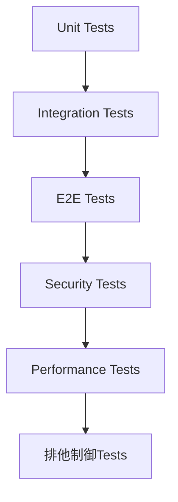

# orchestrator-hybrid v3.0.0 テスト項目書

## メタ情報

| 項目 | 内容 |
|------|------|
| ドキュメントID | TEST-SPEC-ORCH-004 |
| バージョン | 1.0.0 |
| ステータス | ドラフト |
| 作成日 | 2026-01-28 |
| 対応設計書 | BASIC-ORCH-004 v3.0.0 |
| 作成者 | AI Assistant |

---

## 1. テスト方針

### 1.1 テストレベル

| レベル | 対象 | カバレッジ目標 |
|--------|------|---------------|
| Unit | ドメインロジック、ユースケース | 90%以上 |
| Integration | API、CLI、ファイルシステム連携 | 80%以上 |
| E2E | 主要ユーザーフロー | 主要パス100% |

### 1.2 テスト優先度

| 優先度 | 説明 | 実装タイミング |
|--------|------|---------------|
| P0 | クリティカルパス（必須） | Sprint 1 |
| P1 | 重要機能 | Sprint 1-2 |
| P2 | エッジケース | Sprint 2以降 |

### 1.3 テストフレームワーク

- **単体テスト**: Bun test
- **結合テスト**: Bun test + モック
- **E2Eテスト**: Bun test + 実際のgit/gh/AIバックエンド

---

## 2. 単体テスト項目

### 2.1 F-001: Issue取得

#### TC-U-001-001: Issue情報の正常取得

| 項目 | 内容 |
|------|------|
| 優先度 | P0 |
| テスト対象 | `GitHubIssueFetcher.fetch()` |
| 前提条件 | ghコマンドが正常に動作する |
| 入力 | `issueNumber: 42` |
| 期待結果 | `IssueData` オブジェクトが返却される（title, body, labels含む） |

**テストコード雛形:**
```typescript
describe('GitHubIssueFetcher', () => {
  describe('fetch', () => {
    it('should fetch issue data successfully', async () => {
      // Arrange
      const fetcher = new GitHubIssueFetcher();
      const issueNumber = 42;
      
      // Act
      const result = await fetcher.fetch(issueNumber);
      
      // Assert
      expect(result.number).toBe(42);
      expect(result.title).toBeDefined();
      expect(result.body).toBeDefined();
      expect(result.labels).toBeArray();
    });
  });
});
```

#### TC-U-001-002: Issue不在エラー

| 項目 | 内容 |
|------|------|
| 優先度 | P0 |
| テスト対象 | `GitHubIssueFetcher.fetch()` |
| 前提条件 | 存在しないIssue番号を指定 |
| 入力 | `issueNumber: 999999999` |
| 期待結果 | `IssueNotFoundError` がスローされる |

#### TC-U-001-003: ghコマンド未インストール

| 項目 | 内容 |
|------|------|
| 優先度 | P1 |
| テスト対象 | `GitHubIssueFetcher.fetch()` |
| 前提条件 | ghコマンドが存在しない環境 |
| 入力 | `issueNumber: 42` |
| 期待結果 | `GitHubCliError` がスローされる |

#### TC-U-001-004: 認証エラー

| 項目 | 内容 |
|------|------|
| 優先度 | P1 |
| テスト対象 | `GitHubIssueFetcher.fetch()` |
| 前提条件 | gh認証が未完了 |
| 入力 | `issueNumber: 42` |
| 期待結果 | `GitHubCliError` がスローされる |

---

### 2.2 F-002: プロンプト生成

#### TC-U-002-001: 基本プロンプト生成

| 項目 | 内容 |
|------|------|
| 優先度 | P0 |
| テスト対象 | `PromptGenerator.generate()` |
| 前提条件 | Issue情報とHatコンテキストが提供される |
| 入力 | `issue: IssueData`, `context: HatContext` |
| 期待結果 | `.agent/PROMPT.md` にMarkdown形式のプロンプトが生成される |

#### TC-U-002-002: 変数展開

| 項目 | 内容 |
|------|------|
| 優先度 | P0 |
| テスト対象 | `PromptGenerator.applyVariables()` |
| 前提条件 | テンプレートに `{{issue_title}}` が含まれる |
| 入力 | `template: "Issue: {{issue_title}}"`, `variables: {issue_title: "Test"}` |
| 期待結果 | `"Issue: Test"` が返却される |

#### TC-U-002-003: Hat指示の追加

| 項目 | 内容 |
|------|------|
| 優先度 | P1 |
| テスト対象 | `PromptGenerator.generate()` |
| 前提条件 | Hat設定が有効 |
| 入力 | `context.hatName: "Tester"`, `context.hatInstructions: "Write tests"` |
| 期待結果 | プロンプトに "Write tests" が含まれる |

#### TC-U-002-004: テンプレートファイル未検出

| 項目 | 内容 |
|------|------|
| 優先度 | P2 |
| テスト対象 | `PromptGenerator.loadTemplate()` |
| 前提条件 | テンプレートファイルが存在しない |
| 入力 | `templatePath: "nonexistent.md"` |
| 期待結果 | デフォルトテンプレートが使用される |

---

### 2.3 F-003: ループ実行

#### TC-U-003-001: LOOP_COMPLETE検出

| 項目 | 内容 |
|------|------|
| 優先度 | P0 |
| テスト対象 | `LoopEngine.run()` |
| 前提条件 | AIバックエンドが `LOOP_COMPLETE` を出力 |
| 入力 | `prompt: string`, `maxIterations: 100` |
| 期待結果 | `success: true`, `iterations: 1` が返却される |

#### TC-U-003-002: 最大反復回数到達

| 項目 | 内容 |
|------|------|
| 優先度 | P0 |
| テスト対象 | `LoopEngine.run()` |
| 前提条件 | AIバックエンドが `LOOP_COMPLETE` を出力しない |
| 入力 | `maxIterations: 3` |
| 期待結果 | `MaxIterationsReachedError` がスローされる |

#### TC-U-003-003: バックエンド異常終了

| 項目 | 内容 |
|------|------|
| 優先度 | P1 |
| テスト対象 | `LoopEngine.run()` |
| 前提条件 | AIバックエンドが非ゼロ終了コードで終了 |
| 入力 | `prompt: string` |
| 期待結果 | `BackendError` がスローされる |

#### TC-U-003-004: タイムアウト

| 項目 | 内容 |
|------|------|
| 優先度 | P1 |
| テスト対象 | `LoopEngine.run()` |
| 前提条件 | AIバックエンドが `idle_timeout_secs` を超えて出力なし |
| 入力 | `idle_timeout_secs: 5` |
| 期待結果 | セッションが強制終了される |

---

### 2.4 F-004: PR作成

#### TC-U-004-001: PR正常作成

| 項目 | 内容 |
|------|------|
| 優先度 | P0 |
| テスト対象 | `PRCreator.create()` |
| 前提条件 | 変更ファイルが存在する |
| 入力 | `issueNumber: 42`, `branchName: "feature/issue-42"` |
| 期待結果 | PR URLが返却される |

#### TC-U-004-002: 変更ファイルなし

| 項目 | 内容 |
|------|------|
| 優先度 | P1 |
| テスト対象 | `PRCreator.create()` |
| 前提条件 | 変更ファイルが存在しない |
| 入力 | `issueNumber: 42` |
| 期待結果 | PR作成がスキップされる（エラーにならない） |

#### TC-U-004-003: gh認証エラー

| 項目 | 内容 |
|------|------|
| 優先度 | P1 |
| テスト対象 | `PRCreator.create()` |
| 前提条件 | gh認証が未完了 |
| 入力 | `issueNumber: 42` |
| 期待結果 | `GitHubCliError` がスローされる |

---

### 2.5 F-005: 承認ゲート

#### TC-U-005-001: 自動承認モード

| 項目 | 内容 |
|------|------|
| 優先度 | P0 |
| テスト対象 | `ApprovalGate.ask()` |
| 前提条件 | `--auto` フラグが指定されている |
| 入力 | `gateType: "pre-loop"`, `isAuto: true` |
| 期待結果 | `true` が即座に返却される |

#### TC-U-005-002: 手動承認（承認）

| 項目 | 内容 |
|------|------|
| 優先度 | P0 |
| テスト対象 | `ApprovalGate.ask()` |
| 前提条件 | ユーザーが "y" を入力 |
| 入力 | `gateType: "pre-loop"`, `isAuto: false` |
| 期待結果 | `true` が返却される |

#### TC-U-005-003: 手動承認（拒否）

| 項目 | 内容 |
|------|------|
| 優先度 | P0 |
| テスト対象 | `ApprovalGate.ask()` |
| 前提条件 | ユーザーが "n" を入力 |
| 入力 | `gateType: "pre-loop"`, `isAuto: false` |
| 期待結果 | `false` が返却される |

#### TC-U-005-004: タイムアウト

| 項目 | 内容 |
|------|------|
| 優先度 | P1 |
| テスト対象 | `ApprovalGate.ask()` |
| 前提条件 | ユーザーが入力しない |
| 入力 | `gateType: "pre-loop"`, `timeoutMs: 1000` |
| 期待結果 | `false` が返却される |

---

### 2.6 F-006: Hatシステム

#### TC-U-006-001: Hat切り替え

| 項目 | 内容 |
|------|------|
| 優先度 | P0 |
| テスト対象 | `HatSystem.findHatByTrigger()` |
| 前提条件 | Hat定義が読み込まれている |
| 入力 | `topic: "tests.failing"` |
| 期待結果 | `HatDefinition` (Implementer) が返却される |

#### TC-U-006-002: イベント発行

| 項目 | 内容 |
|------|------|
| 優先度 | P0 |
| テスト対象 | `EventBus.emit()` |
| 前提条件 | - |
| 入力 | `topic: "tests.passing"`, `message: "All tests passed"` |
| 期待結果 | イベントが履歴に追加される |

#### TC-U-006-003: イベント抽出

| 項目 | 内容 |
|------|------|
| 優先度 | P1 |
| テスト対象 | `LoopEngine.extractEvent()` |
| 前提条件 | AI出力に `EVENT: tests.passing` が含まれる |
| 入力 | `output: "... EVENT: tests.passing ..."` |
| 期待結果 | `"tests.passing"` が抽出される |

---

### 2.7 F-007: プリセット

#### TC-U-007-001: simpleプリセット読み込み

| 項目 | 内容 |
|------|------|
| 優先度 | P0 |
| テスト対象 | `PresetLoader.load()` |
| 前提条件 | `presets/simple.yml` が存在する |
| 入力 | `presetName: "simple"` |
| 期待結果 | `Config` オブジェクトが返却される（Hatなし） |

#### TC-U-007-002: tddプリセット読み込み

| 項目 | 内容 |
|------|------|
| 優先度 | P0 |
| テスト対象 | `PresetLoader.load()` |
| 前提条件 | `presets/tdd.yml` が存在する |
| 入力 | `presetName: "tdd"` |
| 期待結果 | `Config` オブジェクトが返却される（Tester, Implementer, Refactorer含む） |

#### TC-U-007-003: 設定マージ

| 項目 | 内容 |
|------|------|
| 優先度 | P1 |
| テスト対象 | `PresetLoader.merge()` |
| 前提条件 | ユーザー設定とプリセット設定が存在 |
| 入力 | `userConfig: {backend: "opencode"}`, `presetConfig: {backend: "claude"}` |
| 期待結果 | `userConfig` の値が優先される |

#### TC-U-007-004: プリセット不在

| 項目 | 内容 |
|------|------|
| 優先度 | P2 |
| テスト対象 | `PresetLoader.load()` |
| 前提条件 | 存在しないプリセット名を指定 |
| 入力 | `presetName: "nonexistent"` |
| 期待結果 | エラーがスローされる |

---

### 2.8 F-008: ログ監視

#### TC-U-008-001: ログ取得

| 項目 | 内容 |
|------|------|
| 優先度 | P0 |
| テスト対象 | `LogMonitor.showLogs()` |
| 前提条件 | セッションが実行中 |
| 入力 | `id: "orch-42"`, `options: {follow: false, lines: 100}` |
| 期待結果 | 最新100行のログが表示される |

#### TC-U-008-002: リアルタイムストリーミング

| 項目 | 内容 |
|------|------|
| 優先度 | P0 |
| テスト対象 | `LogMonitor.showLogs()` |
| 前提条件 | セッションが実行中 |
| 入力 | `id: "orch-42"`, `options: {follow: true}` |
| 期待結果 | ログがリアルタイムで表示される |

#### TC-U-008-003: セッション不在

| 項目 | 内容 |
|------|------|
| 優先度 | P1 |
| テスト対象 | `LogMonitor.showLogs()` |
| 前提条件 | 存在しないセッションIDを指定 |
| 入力 | `id: "orch-999"` |
| 期待結果 | エラーが表示される |

---

### 2.9 F-009: ステータスラベル

#### TC-U-009-001: ラベル付与

| 項目 | 内容 |
|------|------|
| 優先度 | P0 |
| テスト対象 | `StatusLabelManager.syncStatus()` |
| 前提条件 | Issue #42が存在する |
| 入力 | `issueNumber: 42`, `status: "running"` |
| 期待結果 | `orch:running` ラベルが付与される |

#### TC-U-009-002: 既存ラベル削除

| 項目 | 内容 |
|------|------|
| 優先度 | P0 |
| テスト対象 | `StatusLabelManager.syncStatus()` |
| 前提条件 | Issue #42に `orch:queued` ラベルが付与されている |
| 入力 | `issueNumber: 42`, `status: "running"` |
| 期待結果 | `orch:queued` が削除され、`orch:running` が付与される |

#### TC-U-009-003: ラベル自動作成

| 項目 | 内容 |
|------|------|
| 優先度 | P1 |
| テスト対象 | `StatusLabelManager.ensureLabelsExist()` |
| 前提条件 | リポジトリに `orch:running` ラベルが存在しない |
| 入力 | - |
| 期待結果 | `orch:running` ラベルが作成される |

---

### 2.10 F-010: Issue依存関係

#### TC-U-010-001: 依存関係抽出

| 項目 | 内容 |
|------|------|
| 優先度 | P0 |
| テスト対象 | `DependencyParser.extractIds()` |
| 前提条件 | Issue本文に "Blocked by #42" が含まれる |
| 入力 | `body: "Blocked by #42"` |
| 期待結果 | `[42]` が返却される |

#### TC-U-010-002: トポロジカルソート

| 項目 | 内容 |
|------|------|
| 優先度 | P0 |
| テスト対象 | `DependencyResolver.resolveOrder()` |
| 前提条件 | Issue #1 → #2 → #3 の依存関係 |
| 入力 | `rootIssueId: 1` |
| 期待結果 | `[3, 2, 1]` の順序が返却される |

#### TC-U-010-003: 循環参照検出

| 項目 | 内容 |
|------|------|
| 優先度 | P1 |
| テスト対象 | `DependencyResolver.resolveOrder()` |
| 前提条件 | Issue #1 → #2 → #1 の循環依存 |
| 入力 | `rootIssueId: 1` |
| 期待結果 | `CircularDependencyError` がスローされる |

---

### 2.11 F-011: Worktree環境分離

#### TC-U-011-001: Worktree作成

| 項目 | 内容 |
|------|------|
| 優先度 | P0 |
| テスト対象 | `WorktreeManager.create()` |
| 前提条件 | Issue #42のworktreeが存在しない |
| 入力 | `issueNumber: 42` |
| 期待結果 | `.worktrees/issue-42/` が作成される |

#### TC-U-011-002: 環境ファイルコピー

| 項目 | 内容 |
|------|------|
| 優先度 | P0 |
| テスト対象 | `WorktreeManager.create()` |
| 前提条件 | `.env` ファイルが存在する |
| 入力 | `issueNumber: 42` |
| 期待結果 | `.worktrees/issue-42/.env` にコピーされる |

#### TC-U-011-003: Worktree削除

| 項目 | 内容 |
|------|------|
| 優先度 | P0 |
| テスト対象 | `WorktreeManager.remove()` |
| 前提条件 | Issue #42のworktreeが存在し、`orch:running` ラベルがない |
| 入力 | `issueNumber: 42` |
| 期待結果 | `.worktrees/issue-42/` が削除される |

#### TC-U-011-004: 実行中worktree削除保護

| 項目 | 内容 |
|------|------|
| 優先度 | P0 |
| テスト対象 | `WorktreeManager.remove()` |
| 前提条件 | Issue #42に `orch:running` ラベルが付与されている |
| 入力 | `issueNumber: 42` |
| 期待結果 | `WorktreeRunningError` がスローされる |

---

### 2.12 F-012: セッション管理

#### TC-U-012-001: セッション作成（Native）

| 項目 | 内容 |
|------|------|
| 優先度 | P0 |
| テスト対象 | `NativeSessionManager.create()` |
| 前提条件 | - |
| 入力 | `id: "orch-42"`, `command: "claude"`, `args: ["--prompt", "test"]` |
| 期待結果 | `Session` オブジェクトが返却される |

#### TC-U-012-002: セッション作成（Tmux）

| 項目 | 内容 |
|------|------|
| 優先度 | P1 |
| テスト対象 | `TmuxSessionManager.create()` |
| 前提条件 | tmuxがインストールされている |
| 入力 | `id: "orch-42"`, `command: "claude"`, `args: ["--prompt", "test"]` |
| 期待結果 | tmuxセッションが作成される |

#### TC-U-012-003: 出力ストリーミング

| 項目 | 内容 |
|------|------|
| 優先度 | P0 |
| テスト対象 | `NativeSessionManager.streamOutput()` |
| 前提条件 | セッションが実行中 |
| 入力 | `id: "orch-42"` |
| 期待結果 | `AsyncIterable<string>` が返却される |

#### TC-U-012-004: セッション終了

| 項目 | 内容 |
|------|------|
| 優先度 | P0 |
| テスト対象 | `NativeSessionManager.kill()` |
| 前提条件 | セッションが実行中 |
| 入力 | `id: "orch-42"` |
| 期待結果 | セッションが終了する |

#### TC-U-012-005: 自動検出（tmux優先）

| 項目 | 内容 |
|------|------|
| 優先度 | P1 |
| テスト対象 | `SessionManagerFactory.create()` |
| 前提条件 | tmuxがインストールされている |
| 入力 | `type: "auto"` |
| 期待結果 | `TmuxSessionManager` が返却される |

---

## 3. 結合テスト項目

### 3.1 API統合テスト

#### TC-I-001: Issue取得 → プロンプト生成

| 項目 | 内容 |
|------|------|
| 優先度 | P0 |
| エンドポイント | CLI: `orch run --issue 42` |
| 前提条件 | Issue #42が存在する |
| 処理フロー | 1. Issue取得<br>2. プロンプト生成<br>3. `.agent/PROMPT.md` 確認 |
| 期待結果 | プロンプトファイルにIssueタイトルと本文が含まれる |

#### TC-I-002: ループ実行 → PR作成

| 項目 | 内容 |
|------|------|
| 優先度 | P0 |
| エンドポイント | CLI: `orch run --issue 42 --auto --create-pr` |
| 前提条件 | Issue #42が存在する |
| 処理フロー | 1. ループ実行<br>2. `LOOP_COMPLETE` 検出<br>3. PR作成 |
| 期待結果 | PR URLが出力される |

#### TC-I-003: Worktree作成 → 実行 → 削除

| 項目 | 内容 |
|------|------|
| 優先度 | P0 |
| エンドポイント | CLI: `orch run --issue 42` → `orch worktree remove 42` |
| 前提条件 | Issue #42が存在する |
| 処理フロー | 1. Worktree作成<br>2. 実行<br>3. 完了<br>4. Worktree削除 |
| 期待結果 | `.worktrees/issue-42/` が削除される |

#### TC-I-004: ステータスラベル更新

| 項目 | 内容 |
|------|------|
| 優先度 | P1 |
| エンドポイント | CLI: `orch run --issue 42` |
| 前提条件 | Issue #42が存在する |
| 処理フロー | 1. 実行開始（`orch:running`）<br>2. 完了（`orch:completed`）<br>3. PR作成（`orch:pr-created`） |
| 期待結果 | 各フェーズで適切なラベルが付与される |

#### TC-I-005: Issue依存関係解決

| 項目 | 内容 |
|------|------|
| 優先度 | P1 |
| エンドポイント | CLI: `orch run --issue 1 --resolve-deps` |
| 前提条件 | Issue #1が #2, #3に依存 |
| 処理フロー | 1. 依存関係解析<br>2. #3 → #2 → #1 の順で実行 |
| 期待結果 | 全てのIssueが正しい順序で実行される |

---

### 3.2 Hat統合テスト

#### TC-I-006: TDDプリセット実行

| 項目 | 内容 |
|------|------|
| 優先度 | P0 |
| エンドポイント | CLI: `orch run --issue 42 --preset tdd` |
| 前提条件 | Issue #42が存在する |
| 処理フロー | 1. Tester Hat（テスト作成）<br>2. Implementer Hat（実装）<br>3. Refactorer Hat（リファクタリング） |
| 期待結果 | 各Hatが順番に実行され、`LOOP_COMPLETE` が出力される |

#### TC-I-007: Hat切り替えイベント

| 項目 | 内容 |
|------|------|
| 優先度 | P1 |
| エンドポイント | CLI: `orch run --issue 42 --preset tdd` |
| 前提条件 | Issue #42が存在する |
| 処理フロー | 1. `task.start` → Tester<br>2. `tests.failing` → Implementer<br>3. `code.written` → Tester<br>4. `tests.passing` → Refactorer |
| 期待結果 | `.agent/events.jsonl` にイベント履歴が記録される |

---

### 3.3 セッション管理統合テスト

#### TC-I-008: ログ監視（Native）

| 項目 | 内容 |
|------|------|
| 優先度 | P0 |
| エンドポイント | CLI: `orch logs --follow` |
| 前提条件 | セッションが実行中 |
| 処理フロー | 1. セッション開始<br>2. ログ監視開始<br>3. リアルタイム出力確認 |
| 期待結果 | セッション出力がリアルタイムで表示される |

#### TC-I-009: セッション一覧

| 項目 | 内容 |
|------|------|
| 優先度 | P1 |
| エンドポイント | CLI: `orch sessions` |
| 前提条件 | 複数のセッションが実行中 |
| 処理フロー | 1. セッション一覧取得<br>2. 表示 |
| 期待結果 | 全てのセッションが表示される |

#### TC-I-010: セッションアタッチ（Tmux）

| 項目 | 内容 |
|------|------|
| 優先度 | P2 |
| エンドポイント | CLI: `orch attach 42` |
| 前提条件 | tmuxセッションが実行中 |
| 処理フロー | 1. セッションにアタッチ<br>2. 対話操作 |
| 期待結果 | tmuxセッションに接続される |

---

## 4. E2Eテスト項目

### 4.1 ユーザーフロー: 基本実行

#### TC-E-001: Issue実行（simple）

| 項目 | 内容 |
|------|------|
| 優先度 | P0 |
| 前提条件 | Issue #42が存在する |
| 手順 | 1. `orch run --issue 42 --auto`<br>2. 実行完了を待つ<br>3. 結果確認 |
| 期待結果 | - `orch:completed` ラベルが付与される<br>- 変更がコミットされる |

#### TC-E-002: Issue実行 + PR作成

| 項目 | 内容 |
|------|------|
| 優先度 | P0 |
| 前提条件 | Issue #42が存在する |
| 手順 | 1. `orch run --issue 42 --auto --create-pr`<br>2. 実行完了を待つ<br>3. PR確認 |
| 期待結果 | - PR URLが出力される<br>- `orch:pr-created` ラベルが付与される<br>- PRに "Closes #42" が含まれる |

---

### 4.2 ユーザーフロー: TDD実行

#### TC-E-003: TDDプリセット実行

| 項目 | 内容 |
|------|------|
| 優先度 | P0 |
| 前提条件 | Issue #42が存在する |
| 手順 | 1. `orch run --issue 42 --preset tdd --auto`<br>2. 実行完了を待つ<br>3. テストファイル確認 |
| 期待結果 | - テストファイルが作成される<br>- 実装ファイルが作成される<br>- テストが通過する |

---

### 4.3 ユーザーフロー: 並列実行

#### TC-E-004: 複数Issue並列実行

| 項目 | 内容 |
|------|------|
| 優先度 | P1 |
| 前提条件 | Issue #42, #43, #44が存在する |
| 手順 | 1. `orch run --issues 42,43,44 --auto`<br>2. 実行完了を待つ<br>3. 各worktree確認 |
| 期待結果 | - `.worktrees/issue-42/`, `.worktrees/issue-43/`, `.worktrees/issue-44/` が作成される<br>- 各Issueが独立して実行される |

---

### 4.4 ユーザーフロー: 依存関係解決

#### TC-E-005: 依存Issue先行実行

| 項目 | 内容 |
|------|------|
| 優先度 | P1 |
| 前提条件 | Issue #1が #2, #3に依存 |
| 手順 | 1. `orch run --issue 1 --resolve-deps --auto`<br>2. 実行完了を待つ<br>3. 実行順序確認 |
| 期待結果 | - #3 → #2 → #1 の順で実行される<br>- 全てのIssueが完了する |

---

## 5. エッジケース・境界値テスト

### 5.1 入力値の境界

| TC-ID | 対象 | 境界条件 | テスト値 | 期待結果 |
|-------|------|---------|---------|---------|
| TC-B-001 | Issue番号 | 最小値 | 1 | 正常取得 |
| TC-B-002 | Issue番号 | 最大値 | 999999999 | 正常取得またはエラー |
| TC-B-003 | 最大反復回数 | 最小値 | 1 | 1回で終了 |
| TC-B-004 | 最大反復回数 | 最大値 | 1000 | 1000回まで実行可能 |
| TC-B-005 | タイムアウト | 最小値 | 1秒 | 1秒でタイムアウト |
| TC-B-006 | ログ行数 | 最小値 | 1 | 1行表示 |
| TC-B-007 | ログ行数 | 最大値 | 10000 | 10000行表示 |

### 5.2 特殊ケース

| TC-ID | ケース | 入力 | 期待結果 |
|-------|--------|------|---------|
| TC-S-001 | Issue本文が空 | `body: ""` | プロンプト生成成功 |
| TC-S-002 | Issue本文が巨大 | `body: "x".repeat(100000)` | プロンプト生成成功（制限あり） |
| TC-S-003 | 特殊文字を含むIssueタイトル | `title: "Test <>&\""` | エスケープされる |
| TC-S-004 | Unicode文字を含むIssue | `title: "テスト🎉"` | 正常に処理される |
| TC-S-005 | 依存関係が深い | 20層の依存 | エラーまたは制限 |
| TC-S-006 | 同時実行数が多い | 100個のIssue | 制限またはキューイング |

---

## 6. セキュリティテスト項目

| TC-ID | テスト観点 | テスト内容 | 期待結果 |
|-------|-----------|-----------|---------|
| TC-SEC-001 | 認証 | gh認証なしでIssue取得 | 認証エラー |
| TC-SEC-002 | 認可 | 権限外リポジトリのIssue取得 | 403エラー |
| TC-SEC-003 | コマンドインジェクション | Issue本文に "; rm -rf /" を含む | エスケープされる |
| TC-SEC-004 | パス走査 | Issue番号に "../" を含む | エラー |
| TC-SEC-005 | 環境変数漏洩 | ログに `ANTHROPIC_API_KEY` が含まれる | マスクされる |
| TC-SEC-006 | ファイル権限 | `.env` ファイルの権限 | 600 |

---

## 7. パフォーマンステスト項目

| TC-ID | テスト対象 | 条件 | 目標値 |
|-------|-----------|------|--------|
| TC-P-001 | CLI起動時間 | `orch --version` | 100ms以内 |
| TC-P-002 | Issue取得 | `gh issue view` | 1秒以内 |
| TC-P-003 | Worktree作成 | `git worktree add` | 3秒以内 |
| TC-P-004 | ログストリーミング | リアルタイム表示 | 500ms遅延以内 |
| TC-P-005 | 並列実行 | 10個のIssue同時実行 | メモリ使用量1GB以内 |

---

## 8. 排他制御テスト（データベース設計書セクション5に基づく）

### 8.1 セッションディレクトリ分離

| TC-ID | テスト内容 | 期待結果 |
|-------|-----------|---------|
| TC-EX-001 | 同時に2つのIssueを実行 | `.agent/sessions/issue-42/` と `.agent/sessions/issue-43/` が独立して作成される |
| TC-EX-002 | 同一Issueを2回実行 | 2回目は既存セッションを上書きまたはエラー |

### 8.2 イベントログの整合性

| TC-ID | テスト内容 | 期待結果 |
|-------|-----------|---------|
| TC-EX-003 | 複数プロセスが同時に `events.jsonl` に書き込み | 全てのイベントが記録される（行単位で原子的） |
| TC-EX-004 | 不正な行が含まれる `events.jsonl` を読み取り | 不正行はスキップされ、正常行のみ処理される |

### 8.3 Worktree環境での分離

| TC-ID | テスト内容 | 期待結果 |
|-------|-----------|---------|
| TC-EX-005 | 2つのworktreeで同時に実行 | 各worktreeの `.agent/` ディレクトリが独立 |
| TC-EX-006 | worktree作成中に別のworktreeを作成 | gitのlock機構により順次実行される |

### 8.4 異常終了時のリカバリ

| TC-ID | テスト内容 | 期待結果 |
|-------|-----------|---------|
| TC-EX-007 | プロセスクラッシュ後に再起動 | `meta.json` の `status` が `failed` に更新される |
| TC-EX-008 | `events.jsonl` 書き込み中断 | 次回読み取り時に不正行がスキップされる |

---

## 9. テスト実行順序



---

## 10. カバレッジ目標

| レイヤー | 目標カバレッジ | 備考 |
|---------|--------------|------|
| Core | 95% | ビジネスロジックは高カバレッジ必須 |
| Adapters | 90% | 外部依存はモック可 |
| CLI | 80% | コマンド実行は結合テストでカバー |
| Session | 85% | 各SessionManager実装をカバー |

---

## 11. テストデータ

### 11.1 正常系テストデータ

```json
{
  "validIssue": {
    "number": 42,
    "title": "Test Issue",
    "body": "This is a test issue",
    "labels": [
      {"name": "enhancement", "color": "a2eeef"}
    ]
  },
  "validConfig": {
    "backend": "claude",
    "auto": false,
    "max_iterations": 100
  }
}
```

### 11.2 異常系テストデータ

```json
{
  "invalidIssueNumber": 999999999,
  "emptyIssueBody": {
    "number": 42,
    "title": "Test",
    "body": "",
    "labels": []
  },
  "circularDependency": {
    "issue1": {"dependencies": [2]},
    "issue2": {"dependencies": [1]}
  }
}
```

---

## 12. テスト環境

### 12.1 必要なツール

| ツール | バージョン | 用途 |
|--------|-----------|------|
| Bun | 1.0+ | ランタイム・テストフレームワーク |
| git | 2.5+ | worktree機能 |
| gh | 最新 | GitHub CLI |
| tmux | 3.0+ | セッション管理（オプション） |
| zellij | 最新 | セッション管理（オプション） |

### 12.2 モック対象

| 対象 | モック方法 |
|------|----------|
| `gh` コマンド | `exec` 関数をモック |
| `git` コマンド | `exec` 関数をモック |
| AIバックエンド | `IBackend` インターフェースをモック |
| ファイルシステム | `Bun.file` / `Bun.write` をモック |

---

## 変更履歴

| バージョン | 日付 | 変更内容 | 作成者 |
|-----------|------|----------|--------|
| 1.0.0 | 2026-01-28 | 初版作成 | AI Assistant |
