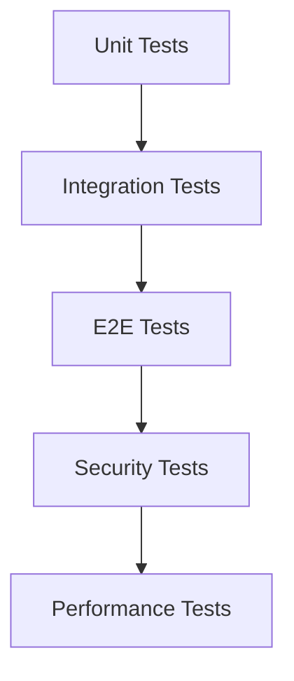

# orchestrator-hybrid v1.4.0 テスト項目書

## メタ情報

| 項目 | 内容 |
|------|------|
| ドキュメントID | TEST-SPEC-v1.4.0 |
| バージョン | 1.0.0 |
| 作成日 | 2027-01-27 |
| 対象バージョン | v1.4.0 |
| ステータス | ドラフト |
| 作成者 | AI Assistant |

---

## 1. テスト方針

### 1.1 テストレベル

| レベル | 対象 | カバレッジ目標 |
|--------|------|---------------|
| Unit | ドメインロジック、ユースケース | 90%以上 |
| Integration | API、ファイルI/O、プロセス実行 | 80%以上 |
| E2E | 主要ユーザーフロー | 主要パス100% |

### 1.2 テスト優先度

| 優先度 | 説明 | 実装タイミング |
|--------|------|---------------|
| High | クリティカルパス（必須機能） | Sprint 1 |
| Medium | 重要機能 | Sprint 1-2 |
| Low | エッジケース | Sprint 2以降 |

---

## 2. F-013: Hat別モデル選択

### 2.1 単体テスト

| ID | テスト名 | 前提条件 | 手順 | 期待結果 | 優先度 |
|----|---------|---------|------|---------|--------|
| TC-F013-001 | Hat固有のモデルを返す | `hats.planner.model = "opus"` が設定されている | `modelSelector.resolveModel("planner")` を呼び出す | `"opus"` が返される | High |
| TC-F013-002 | グローバルモデルを返す | `backend.model = "sonnet"` が設定、Hat固有モデルなし | `modelSelector.resolveModel("implementer")` を呼び出す | `"sonnet"` が返される | High |
| TC-F013-003 | デフォルトモデルを返す | モデル設定なし | `modelSelector.resolveModel("reviewer")` を呼び出す | `"sonnet"` が返される | High |
| TC-F013-004 | 不正なモデル名はデフォルトにフォールバック | `backend.model = "invalid-model"` | `modelSelector.resolveModel("any")` を呼び出す | `"sonnet"` が返され、警告ログが出力される | Medium |
| TC-F013-005 | フルモデル名を許可 | `backend.model = "claude-sonnet-4-5-20250929"` | `modelSelector.resolveModel("any")` を呼び出す | `"claude-sonnet-4-5-20250929"` が返される | Medium |
| TC-F013-006 | getAllModels()でマッピングを取得 | 複数のHatが定義されている | `modelSelector.getAllModels()` を呼び出す | Hat名→モデル名のマッピングが返される | Low |

### 2.2 統合テスト

| ID | テスト名 | 前提条件 | 手順 | 期待結果 | 優先度 |
|----|---------|---------|------|---------|--------|
| TC-F013-101 | `--model opus`フラグ | - | `orch run --issue 42 --model opus` を実行 | すべてのHatで `opus` モデルが使用される | High |
| TC-F013-102 | 設定ファイルのみ | `orch.yml` にHat固有モデル設定あり | `orch run --issue 42` を実行 | 各Hatが設定されたモデルで実行される | High |
| TC-F013-103 | CLIオプションが設定ファイルを上書き | `orch.yml` に設定あり | `orch run --issue 42 --model haiku` を実行 | すべてのHatで `haiku` が使用される | Medium |

---

## 3. F-014: Memoriesシステム

### 3.1 単体テスト

| ID | テスト名 | 前提条件 | 手順 | 期待結果 | 優先度 |
|----|---------|---------|------|---------|--------|
| TC-F014-001 | Memoryを追加 | MemoryManagerが初期化されている | `addMemory("Always use try-catch", ["pattern"])` を呼び出す | `memories.md` に追記される | High |
| TC-F014-002 | Memoryを検索 | 複数のMemoryが登録されている | `searchMemories("try-catch")` を呼び出す | マッチしたMemoryが返される | High |
| TC-F014-003 | Memoryを削除 | 複数のMemoryが登録されている | `deleteMemory(id)` を呼び出す | 指定されたMemoryが削除される | High |
| TC-F014-004 | inject: auto でプロンプトに注入 | `inject: auto` が設定されている | `getInjectionContent()` を呼び出す | Memoriesがプロンプト用文字列として返される | High |
| TC-F014-005 | inject: manual でプロンプトに注入しない | `inject: manual` が設定されている | `getInjectionContent()` を呼び出す | 空文字列が返される | High |
| TC-F014-006 | memories.mdが破損 | 破損したファイルが存在 | `loadMemories()` を呼び出す | 警告ログ出力、空配列が返される | Medium |
| TC-F014-007 | サイズ上限超過 | 10MB超のファイル | `addMemory()` を呼び出す | 警告ログが出力される | Low |

### 3.2 統合テスト

| ID | テスト名 | 前提条件 | 手順 | 期待結果 | 優先度 |
|----|---------|---------|------|---------|--------|
| TC-F014-101 | Worktree間でmemoriesを共有 | Worktreeが作成されている | Worktree内で `memories.md` を確認 | シンボリックリンクが作成されている | High |
| TC-F014-102 | 複数ループで同時にMemoryを追加 | 複数のループが並列実行中 | 各ループから `addMemory()` を呼び出す | 競合なく追記される | Medium |
| TC-F014-103 | CLIコマンド: memory add | - | `orch tools memory add "content" --tags tag1,tag2` を実行 | Memoryが追加される | High |
| TC-F014-104 | CLIコマンド: memory search | Memoriesが登録されている | `orch tools memory search "query"` を実行 | マッチしたMemoryが表示される | Medium |
| TC-F014-105 | CLIコマンド: memory list | Memoriesが登録されている | `orch tools memory list` を実行 | すべてのMemoryが表示される | Medium |

---

## 4. F-015: Tasksシステム

### 4.1 単体テスト

| ID | テスト名 | 前提条件 | 手順 | 期待結果 | 優先度 |
|----|---------|---------|------|---------|--------|
| TC-F015-001 | Taskを追加 | TaskManagerが初期化されている | `addTask("Title", 2)` を呼び出す | `tasks.jsonl` に追記される | High |
| TC-F015-002 | Task状態を更新 | Taskが登録されている | `updateStatus(taskId, "in-progress")` を呼び出す | 新しい行が追記される | High |
| TC-F015-003 | ブロックされていないTaskを取得 | 依存関係のあるTaskが登録されている | `getReadyTasks()` を呼び出す | 依存タスクが完了しているTaskのみ返される | High |
| TC-F015-004 | ループ完了検証 | すべてのTaskが `closed` | `isLoopComplete(tasks)` を呼び出す | `true` が返される | High |
| TC-F015-005 | ループ未完了検証 | 一部のTaskが `open` | `isLoopComplete(tasks)` を呼び出す | `false` が返される | High |
| TC-F015-006 | tasks.jsonlが破損 | 破損したファイルが存在 | `loadTasks()` を呼び出す | 警告ログ出力、空配列が返される | Medium |
| TC-F015-007 | 依存タスクが存在しない | 存在しないタスクIDが `blocked_by` に指定されている | `getReadyTasks()` を呼び出す | 警告ログ出力、依存関係を無視 | Low |

### 4.2 統合テスト

| ID | テスト名 | 前提条件 | 手順 | 期待結果 | 優先度 |
|----|---------|---------|------|---------|--------|
| TC-F015-101 | 依存関係のあるタスクを実行 | Task A が Task B に依存 | ループを実行 | Task B が先に実行される | High |
| TC-F015-102 | すべてのタスクが完了 | すべてのTaskが `closed` | ループを実行 | ループが完了する | High |
| TC-F015-103 | CLIコマンド: task add | - | `orch tools task add "Title" -p 2` を実行 | Taskが追加される | High |
| TC-F015-104 | CLIコマンド: task ready | Tasksが登録されている | `orch tools task ready` を実行 | ブロックされていないTaskが表示される | Medium |
| TC-F015-105 | CLIコマンド: task close | Taskが登録されている | `orch tools task close <id>` を実行 | Taskが完了状態になる | Medium |

---

## 5. F-016: セッション記録・リプレイ

### 5.1 単体テスト

| ID | テスト名 | 前提条件 | 手順 | 期待結果 | 優先度 |
|----|---------|---------|------|---------|--------|
| TC-F016-001 | セッションを記録 | SessionRecorderが初期化されている | `recordIteration()` を呼び出す | `session.jsonl` に追記される | High |
| TC-F016-002 | セッションをリプレイ | 記録ファイルが存在 | `replay()` を呼び出す | 記録された出力が使用される | High |
| TC-F016-003 | リプレイ時にAPIコールしない | 記録ファイルが存在 | `replay()` を呼び出す | APIコールが発生しない | High |
| TC-F016-004 | 記録ファイルへの書き込み失敗 | ディスク容量不足 | `recordIteration()` を呼び出す | エラーログ出力、記録をスキップして実行継続 | Medium |
| TC-F016-005 | リプレイファイルが存在しない | ファイルが存在しない | `replay()` を呼び出す | エラーログ出力、実行を中断 | Medium |

### 5.2 統合テスト

| ID | テスト名 | 前提条件 | 手順 | 期待結果 | 優先度 |
|----|---------|---------|------|---------|--------|
| TC-F016-101 | 記録したセッションをリプレイ | セッションが記録されている | `orch replay session.jsonl` を実行 | 同じ結果が得られる | High |
| TC-F016-102 | Smoke test | フィクスチャが存在 | テストを実行 | フィクスチャが正常にリプレイされる | High |
| TC-F016-103 | `--record-session`オプション | - | `orch run --issue 42 --record-session session.jsonl` を実行 | セッションが記録される | High |

---

## 6. F-017: マルチループ並列実行

### 6.1 単体テスト

| ID | テスト名 | 前提条件 | 手順 | 期待結果 | 優先度 |
|----|---------|---------|------|---------|--------|
| TC-F017-001 | Worktreeを作成 | WorktreeManagerが初期化されている | `createWorktree(loopId)` を呼び出す | `.worktrees/<loop-id>/` が作成される | High |
| TC-F017-002 | Memoriesをシンボリックリンク | Worktreeが作成されている | Worktree内の `memories.md` を確認 | シンボリックリンクが作成される | High |
| TC-F017-003 | ループ状態を更新 | LoopRegistryが初期化されている | `updateLoopState(loopId, "merged")` を呼び出す | `loops.json` が更新される | High |
| TC-F017-004 | 自動マージ成功 | コンフリクトなし | `mergeWorktree(loopId)` を呼び出す | 状態が `merged` に遷移 | High |
| TC-F017-005 | 自動マージ失敗 | コンフリクトあり | `mergeWorktree(loopId)` を呼び出す | 状態が `needs-review` に遷移 | High |
| TC-F017-006 | worktree作成失敗 | git worktreeコマンドが失敗 | `createWorktree(loopId)` を呼び出す | エラーログ出力、プライマリループの完了を待機 | Medium |

### 6.2 統合テスト

| ID | テスト名 | 前提条件 | 手順 | 期待結果 | 優先度 |
|----|---------|---------|------|---------|--------|
| TC-F017-101 | 複数ループを並列実行 | - | 複数の `orch run` を同時実行 | ファイルシステムの競合なし | High |
| TC-F017-102 | プライマリループ完了後、セカンダリループをマージ | セカンダリループが完了 | 自動マージを実行 | マージ成功 | High |
| TC-F017-103 | CLIコマンド: loops | ループが実行中 | `orch loops` を実行 | ループ一覧が表示される | Medium |
| TC-F017-104 | CLIコマンド: loops logs | ループが実行中 | `orch loops logs <loop-id> --follow` を実行 | ログがリアルタイムで表示される | Medium |

---

## 7. F-018: Hat別バックエンド選択

### 7.1 単体テスト

| ID | テスト名 | 前提条件 | 手順 | 期待結果 | 優先度 |
|----|---------|---------|------|---------|--------|
| TC-F018-001 | Named backend指定 | `hats.builder.backend = "claude"` | `selectBackend("builder")` を呼び出す | ClaudeAdapterが返される | High |
| TC-F018-002 | Kiro agent形式 | `hats.researcher.backend = { type: "kiro", agent: "researcher" }` | `selectBackend("researcher")` を呼び出す | KiroAdapterが返される | High |
| TC-F018-003 | Hat固有のバックエンド優先 | Hat固有とグローバル両方設定 | `selectBackend("hat")` を呼び出す | Hat固有の設定が使用される | High |
| TC-F018-004 | グローバルバックエンドフォールバック | Hat固有設定なし | `selectBackend("hat")` を呼び出す | グローバル設定が使用される | High |
| TC-F018-005 | 不正なバックエンド設定 | 不正な設定 | `selectBackend("hat")` を呼び出す | エラーログ出力、フォールバック | Medium |

### 7.2 統合テスト

| ID | テスト名 | 前提条件 | 手順 | 期待結果 | 優先度 |
|----|---------|---------|------|---------|--------|
| TC-F018-101 | 複数Hatで異なるバックエンド | 各Hatに異なるバックエンド設定 | ループを実行 | 各Hatが指定されたバックエンドで実行される | High |
| TC-F018-102 | Kiro agentでのHat実行 | Kiro agent設定あり | ループを実行 | Kiroバックエンドが正しく呼び出される | High |

---

## 8. F-019: カスタムバックエンド

### 8.1 単体テスト

| ID | テスト名 | 前提条件 | 手順 | 期待結果 | 優先度 |
|----|---------|---------|------|---------|--------|
| TC-F019-001 | prompt_mode: arg | `prompt_mode: "arg"` が設定 | `execute(prompt)` を呼び出す | コマンドライン引数でプロンプトが渡される | High |
| TC-F019-002 | prompt_mode: stdin | `prompt_mode: "stdin"` が設定 | `execute(prompt)` を呼び出す | 標準入力でプロンプトが渡される | High |
| TC-F019-003 | prompt_flag指定あり | `prompt_flag: "-p"` が設定 | `buildArgs(prompt)` を呼び出す | フラグ付きで引数が構築される | High |
| TC-F019-004 | prompt_flag指定なし | `prompt_flag` 未設定 | `buildArgs(prompt)` を呼び出す | 位置引数として渡される | High |
| TC-F019-005 | 実行成功 | exitCode = 0 | `execute(prompt)` を呼び出す | 標準出力が返される | High |
| TC-F019-006 | 実行失敗 | exitCode ≠ 0 | `execute(prompt)` を呼び出す | エラーがスローされる | High |
| TC-F019-007 | コマンドが見つからない | コマンドが存在しない | `execute(prompt)` を呼び出す | エラーログ出力、実行を中断 | Medium |

### 8.2 統合テスト

| ID | テスト名 | 前提条件 | 手順 | 期待結果 | 優先度 |
|----|---------|---------|------|---------|--------|
| TC-F019-101 | カスタムバックエンドでHat実行 | カスタムバックエンド設定あり | ループを実行 | カスタムコマンドが正しく呼び出される | High |
| TC-F019-102 | 複数のカスタムバックエンド | 各Hatに異なるカスタムバックエンド | ループを実行 | 各Hatが異なるカスタムバックエンドで実行される | Medium |

---

## 9. F-020: イベント発行CLI

### 9.1 単体テスト

| ID | テスト名 | 前提条件 | 手順 | 期待結果 | 優先度 |
|----|---------|---------|------|---------|--------|
| TC-F020-001 | 基本的なイベント発行 | EventEmitterが初期化されている | `emit("topic", "message")` を呼び出す | `events.jsonl` に記録される | High |
| TC-F020-002 | JSONペイロード | `json: true` が設定 | `emit("topic", '{"key": "value"}', { json: true })` を呼び出す | JSON.parseが呼ばれる | High |
| TC-F020-003 | ターゲットHat指定 | `target: "reviewer"` が設定 | `emit("topic", "message", { target: "reviewer" })` を呼び出す | targetフィールドが設定される | High |
| TC-F020-004 | JSON解析失敗 | 不正なJSON | `emit("topic", "invalid", { json: true })` を呼び出す | エラーがスローされる | Medium |
| TC-F020-005 | トピックが空 | トピックが空文字列 | `emit("", "message")` を呼び出す | エラーがスローされる | Medium |

### 9.2 統合テスト

| ID | テスト名 | 前提条件 | 手順 | 期待結果 | 優先度 |
|----|---------|---------|------|---------|--------|
| TC-F020-101 | `orch emit`コマンド実行 | - | `orch emit "topic" "message"` を実行 | イベントが発行され、Hatがトリガーされる | High |
| TC-F020-102 | ハンドオフイベント | - | `orch emit "handoff" --target reviewer "message"` を実行 | 特定Hatのみがトリガーされる | High |
| TC-F020-103 | JSONペイロード | - | `orch emit "topic" --json '{"key": "value"}'` を実行 | JSONペイロードが正しく解析される | Medium |

---

## 10. F-021: Globパターンマッチング

### 10.1 単体テスト

| ID | テスト名 | 前提条件 | 手順 | 期待結果 | 優先度 |
|----|---------|---------|------|---------|--------|
| TC-F021-001 | 完全一致 | パターン `task.start` が定義 | `match("task.start")` を呼び出す | 具体的パターンのHatがマッチ | High |
| TC-F021-002 | プレフィックスワイルドカード | パターン `build.*` が定義 | `match("build.done")` を呼び出す | `build.*` がマッチ | High |
| TC-F021-003 | サフィックスワイルドカード | パターン `*.done` が定義 | `match("build.done")` を呼び出す | `*.done` がマッチ | High |
| TC-F021-004 | グローバルワイルドカード | パターン `*` が定義 | `match("custom.event")` を呼び出す | `*` がマッチ | High |
| TC-F021-005 | 具体的パターン優先 | 具体的パターンとワイルドカード両方定義 | `match("task.start")` を呼び出す | 具体的パターンが優先される | High |
| TC-F021-006 | 曖昧なルーティング | 複数の具体的パターンがマッチ | `match("topic")` を呼び出す | エラーがスローされる | Medium |
| TC-F021-007 | マッチなし | マッチするパターンなし | `match("unknown")` を呼び出す | 警告ログ出力、空配列が返される | Low |

### 10.2 統合テスト

| ID | テスト名 | 前提条件 | 手順 | 期待結果 | 優先度 |
|----|---------|---------|------|---------|--------|
| TC-F021-101 | 複数のワイルドカードパターン | 複数のワイルドカードパターンが定義 | イベントを発行 | すべてのマッチしたHatがトリガーされる | High |
| TC-F021-102 | フォールバックHat | グローバルワイルドカードのみ定義 | イベントを発行 | 他にマッチがない場合のみトリガーされる | Medium |

---

## 11. エッジケース・境界値テスト

### 11.1 入力値の境界

| TC-ID | 対象 | 境界条件 | テスト値 | 期待結果 |
|-------|------|---------|---------|---------|
| TC-B-001 | Memory content | 最小値 | 1文字 | 正常に追加される |
| TC-B-002 | Memory content | 最大値 | 10MB | 警告ログ出力 |
| TC-B-003 | Task priority | 最小値 | 1 | 正常に追加される |
| TC-B-004 | Task priority | 最大値 | 5 | 正常に追加される |
| TC-B-005 | Session record | 最大サイズ | 100MB | 警告ログ出力、記録を停止 |

### 11.2 特殊ケース

| TC-ID | ケース | 入力 | 期待結果 |
|-------|--------|------|---------|
| TC-S-001 | 空文字列 | `""` | エラーまたは警告 |
| TC-S-002 | null | `null` | エラーまたは警告 |
| TC-S-003 | 特殊文字 | `!@#$%^&*()` | エスケープされる |
| TC-S-004 | Unicode | `日本語テスト` | 正常に処理される |
| TC-S-005 | 長いパス | 260文字以上のパス | 正常に処理される |

---

## 12. セキュリティテスト項目

| TC-ID | テスト観点 | テスト内容 | 期待結果 |
|-------|-----------|-----------|---------|
| TC-SEC-001 | コマンドインジェクション | カスタムバックエンドに不正なコマンド | エスケープされる |
| TC-SEC-002 | パストラバーサル | `../../etc/passwd` のようなパス | 拒否される |
| TC-SEC-003 | JSONインジェクション | 不正なJSONペイロード | エラーがスローされる |
| TC-SEC-004 | シンボリックリンク攻撃 | 不正なシンボリックリンク | 検出・拒否される |

---

## 13. パフォーマンステスト項目

| TC-ID | テスト対象 | 条件 | 目標値 |
|-------|-----------|------|--------|
| TC-P-001 | Memory検索 | 1000件のMemory | 100ms以内 |
| TC-P-002 | Task依存関係解決 | 100件のTask | 50ms以内 |
| TC-P-003 | Worktree作成 | - | 5秒以内 |
| TC-P-004 | Session記録 | 1000イテレーション | 10秒以内 |
| TC-P-005 | Globパターンマッチング | 100件のHat | 10ms以内 |

---

## 14. テストデータ

### 14.1 正常系テストデータ

```yaml
# orch.yml
backend:
  type: claude
  model: sonnet

hats:
  planner:
    name: "📋 Planner"
    model: opus
    backend: claude
    triggers: ["task.start"]
    publishes: ["plan.ready"]

  implementer:
    name: "🔨 Implementer"
    triggers: ["plan.ready"]
    publishes: ["code.written"]

memories:
  enabled: true
  inject: auto

tasks:
  enabled: true
```

### 14.2 異常系テストデータ

```yaml
# 不正なモデル名
backend:
  type: claude
  model: invalid-model

# 不正なバックエンド設定
hats:
  invalid_hat:
    backend:
      command: "non-existent-command"
```

---

## 15. テスト実行順序



---

## 16. カバレッジ目標

| レイヤー | 目標カバレッジ | 備考 |
|---------|--------------|------|
| Core | 95% | ビジネスロジックは高カバレッジ必須 |
| Adapters | 90% | バックエンドアダプターは高カバレッジ必須 |
| CLI | 70% | CLIはE2Eでカバー |
| Utils | 80% | ユーティリティは中程度のカバレッジ |

---

## 17. テスト環境

### 17.1 必要な環境

| 環境 | バージョン | 備考 |
|------|-----------|------|
| Bun | 1.0以上 | ランタイム |
| Node.js | 20以上 | 互換性確認用 |
| Git | 2.30以上 | Worktree機能 |
| Docker | 20.10以上 | container-use環境 |

### 17.2 テストツール

| ツール | 用途 |
|--------|------|
| Bun Test | 単体テスト・統合テスト |
| Playwright | E2Eテスト（CLI） |
| c8 | カバレッジ測定 |

---

## 18. 変更履歴

| バージョン | 日付 | 変更内容 | 変更者 |
|-----------|------|---------|--------|
| 1.0.0 | 2027-01-27 | 初版作成 | AI Assistant |
