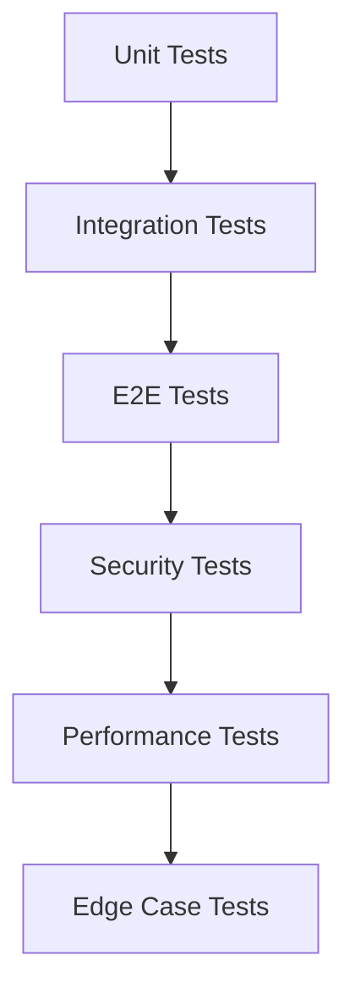

# orchestrator-hybrid v2.0.0 テスト項目書

## メタ情報

| 項目 | 内容 |
|------|------|
| ドキュメントID | TEST-SPEC-v2.0.0 |
| バージョン | 1.0.0 |
| 作成日 | 2027-01-27 |
| 対象バージョン | v2.0.0 |
| ステータス | ドラフト |
| 作成者 | AI Assistant |

---

## 1. テスト方針

### 1.1 テストレベル

| レベル | 対象 | カバレッジ目標 |
|--------|------|---------------|
| Unit | 各クラス・関数の単体テスト | 90%以上 |
| Integration | モジュール間連携テスト | 80%以上 |
| E2E | 実際のワークフローテスト | 主要パス100% |

### 1.2 テスト優先度

| 優先度 | 説明 | 実装タイミング |
|--------|------|---------------|
| High | クリティカルパス（必須機能） | Phase 1 |
| Medium | 重要機能 | Phase 1-2 |
| Low | エッジケース | Phase 2以降 |

---

## 2. Phase 1: 基盤改善

### 2.1 F-101: run設定デフォルト化

#### 2.1.1 単体テスト

| ID | テスト名 | 前提条件 | 手順 | 期待結果 | 優先度 |
|----|---------|---------|------|---------|--------|
| TC-F101-U-001 | デフォルト値使用 | オプション未指定 | ConfigMerger.merge({cliOptions: {}}) | auto_mode=false, create_pr=false, draft_pr=false | High |
| TC-F101-U-002 | CLIオプション優先 | orch.ymlにauto_mode=false | --auto指定でmerge() | auto_mode=true（CLI優先） | High |
| TC-F101-U-003 | 設定ファイル使用 | orch.ymlにauto_mode=true | CLIオプションなしでmerge() | auto_mode=true（ファイル） | High |
| TC-F101-U-004 | 部分的な設定 | orch.ymlにauto_modeのみ | merge() | auto_mode=ファイル値、他はデフォルト | Medium |
| TC-F101-U-005 | 不正なYAML | 壊れたorch.yml | merge() | デフォルト値使用、警告ログ出力 | Medium |
| TC-F101-U-006 | 設定ファイル不在 | orch.yml存在しない | merge() | デフォルト値使用、警告ログ出力 | Medium |
| TC-F101-U-007 | 不正な型 | auto_mode="string" | merge() | zodバリデーション失敗、デフォルト値使用 | Low |
| TC-F101-U-008 | runセクション不在 | orch.ymlにrunセクションなし | merge() | デフォルト値使用 | Low |

#### 2.1.2 統合テスト

| ID | テスト名 | 前提条件 | 手順 | 期待結果 | 優先度 |
|----|---------|---------|------|---------|--------|
| TC-F101-I-001 | CLI統合 | orch.ymlにrun設定 | orch run --issue 42 | 設定ファイルの値が使用される | High |
| TC-F101-I-002 | CLIオプション上書き | orch.ymlにauto_mode=false | orch run --issue 42 --auto | auto_mode=true（CLI優先） | High |

---

### 2.2 F-102: CLIリファクタリング

#### 2.2.1 単体テスト

| ID | テスト名 | 前提条件 | 手順 | 期待結果 | 優先度 |
|----|---------|---------|------|---------|--------|
| TC-F102-U-001 | runコマンド実行 | - | RunCommand.execute({issue: "42"}) | runLoop()が呼ばれる | High |
| TC-F102-U-002 | Issue未指定エラー | - | RunCommand.execute({}) | "Either --issue or --issues is required"エラー | High |
| TC-F102-U-003 | 複数Issue実行 | - | RunCommand.execute({issues: "42,43,44"}) | runMultipleLoops()が呼ばれる | High |
| TC-F102-U-004 | initコマンド実行 | - | InitCommand.execute({}) | orch.yml作成 | Medium |
| TC-F102-U-005 | logsコマンド実行 | task.log存在 | LogsCommand.execute({task: "123"}) | ログ表示 | Medium |
| TC-F102-U-006 | statusコマンド実行 | - | StatusCommand.execute({task: "123"}) | タスク状態表示 | Medium |
| TC-F102-U-007 | eventsコマンド実行 | - | EventsCommand.execute({}) | イベント履歴表示 | Low |
| TC-F102-U-008 | cancelコマンド実行 | タスク実行中 | CancelCommand.execute({task: "123"}) | タスクキャンセル | Medium |
| TC-F102-U-009 | clearコマンド実行 | 完了タスクあり | ClearCommand.execute({force: true}) | タスク履歴クリア | Low |

#### 2.2.2 統合テスト

| ID | テスト名 | 前提条件 | 手順 | 期待結果 | 優先度 |
|----|---------|---------|------|---------|--------|
| TC-F102-I-001 | CLI全コマンド実行 | - | 各コマンドを順次実行 | すべて正常終了 | High |
| TC-F102-I-002 | エラーハンドリング | 不正なオプション | orch run --invalid | エラーメッセージ表示、exit(1) | Medium |

---

### 2.3 F-103: バックエンド出力ストリーミング

#### 2.3.1 単体テスト

| ID | テスト名 | 前提条件 | 手順 | 期待結果 | 優先度 |
|----|---------|---------|------|---------|--------|
| TC-F103-U-001 | stdout書き込み | - | writeStdout("Hello") | backend.logに[stdout]タグ付きで書き込み | High |
| TC-F103-U-002 | stderr書き込み | - | writeStderr("Error") | backend.logに[stderr]タグ付きで書き込み | High |
| TC-F103-U-003 | タイムスタンプ付与 | includeTimestamp=true | writeStdout("Test") | ISO 8601形式のタイムスタンプ付与 | Medium |
| TC-F103-U-004 | タイムスタンプなし | includeTimestamp=false | writeStdout("Test") | タイムスタンプなし | Medium |
| TC-F103-U-005 | バッファリング | bufferSize=100 | 100バイト以上書き込み | バッファがフラッシュされる | Medium |
| TC-F103-U-006 | close()呼び出し | データ書き込み後 | close() | バッファフラッシュ、ファイル閉じる | High |
| TC-F103-U-007 | ログディレクトリ自動作成 | ディレクトリ不在 | new BackendOutputStreamer() | ディレクトリ自動作成 | Medium |
| TC-F103-U-008 | 書き込み失敗時の継続 | ディスク容量不足 | writeStdout() | 警告ログ出力、処理継続 | Low |
| TC-F103-U-009 | Buffer入力 | - | writeStdout(Buffer.from("data")) | 文字列に変換して書き込み | Medium |

#### 2.3.2 統合テスト

| ID | テスト名 | 前提条件 | 手順 | 期待結果 | 優先度 |
|----|---------|---------|------|---------|--------|
| TC-F103-I-001 | AIエージェント実行 | - | claude実行、出力キャプチャ | backend.logにリアルタイム書き込み | High |
| TC-F103-I-002 | 複数プロセス同時書き込み | - | 並列実行 | 各プロセスのログが混在せず書き込まれる | Medium |

---

### 2.4 F-104: logsコマンド拡張

#### 2.4.1 単体テスト

| ID | テスト名 | 前提条件 | 手順 | 期待結果 | 優先度 |
|----|---------|---------|------|---------|--------|
| TC-F104-U-001 | task.log表示（デフォルト） | task.log存在 | logs --task 123 | task.log表示 | High |
| TC-F104-U-002 | backend.log表示 | backend.log存在 | logs --task 123 --source backend | backend.log表示 | High |
| TC-F104-U-003 | --source未指定 | task.log存在 | logs --task 123 | task.log表示（デフォルト） | High |
| TC-F104-U-004 | リアルタイム監視 | backend.log存在 | logs --task 123 --source backend --follow | backend.logをリアルタイム監視 | High |
| TC-F104-U-005 | 最後のN行表示 | backend.log存在 | logs --task 123 --source backend --lines 50 | 最後の50行表示 | Medium |
| TC-F104-U-006 | ログファイル不在 | ログファイルなし | logs --task 123 --source backend | "Log file not found"エラー | Medium |
| TC-F104-U-007 | 無効なログソース | - | logs --task 123 --source invalid | "Invalid log source"エラー | Low |
| TC-F104-U-008 | タスクID未指定 | - | logs --source backend | "--task is required"エラー | Medium |

#### 2.4.2 統合テスト

| ID | テスト名 | 前提条件 | 手順 | 期待結果 | 優先度 |
|----|---------|---------|------|---------|--------|
| TC-F104-I-001 | ログソース切り替え | task.log, backend.log存在 | --sourceで切り替え | 各ログが正しく表示される | High |
| TC-F104-I-002 | リアルタイム監視中の書き込み | --follow実行中 | 新規ログ書き込み | 即座に表示される | Medium |

---

## 3. Phase 2: 並列実行環境

### 3.1 F-201: WorktreeManager

#### 3.1.1 単体テスト

| ID | テスト名 | 前提条件 | 手順 | 期待結果 | 優先度 |
|----|---------|---------|------|---------|--------|
| TC-F201-U-001 | worktree作成成功 | enabled=true | createWorktree(42, "container-use", "abc-123") | WorktreeInfo返却、worktrees.jsonに保存 | High |
| TC-F201-U-002 | worktree作成（無効時） | enabled=false | createWorktree(42, "host") | null返却、何も実行しない | High |
| TC-F201-U-003 | worktree作成（既存ディレクトリ） | ディレクトリ存在 | createWorktree(42, "host") | WorktreeErrorスロー | Medium |
| TC-F201-U-004 | worktree削除成功 | worktree存在 | removeWorktree(42, true) | worktree削除、ブランチ削除、worktrees.jsonから削除 | High |
| TC-F201-U-005 | worktree削除（ブランチ保持） | worktree存在 | removeWorktree(42, false) | worktree削除、ブランチ保持 | Medium |
| TC-F201-U-006 | worktree削除（存在しない） | worktree不在 | removeWorktree(999) | 何もしない、エラーなし | Low |
| TC-F201-U-007 | worktree一覧取得 | 複数worktree存在 | listWorktrees() | 全WorktreeInfo配列返却 | Medium |
| TC-F201-U-008 | worktree一覧取得（空） | worktree不在 | listWorktrees() | 空配列返却 | Low |
| TC-F201-U-009 | worktree情報取得 | worktree存在 | getWorktree(42) | WorktreeInfo返却 | Medium |
| TC-F201-U-010 | worktree情報取得（不在） | worktree不在 | getWorktree(999) | null返却 | Low |
| TC-F201-U-011 | worktree情報更新 | worktree存在 | updateWorktree(42, {environmentId: "xyz"}) | 環境ID更新 | High |
| TC-F201-U-012 | worktree情報更新（不在） | worktree不在 | updateWorktree(999, {status: "merged"}) | WorktreeErrorスロー | Medium |
| TC-F201-U-013 | 環境ファイルコピー | .env存在 | createWorktree() | .envがworktreeにコピーされる | Medium |
| TC-F201-U-014 | 環境ファイルコピー（不在） | .env不在 | createWorktree() | スキップ、エラーなし | Low |
| TC-F201-U-015 | 排他制御 | 並列更新 | 複数プロセスから同時更新 | データ整合性が保たれる | High |

#### 3.1.2 統合テスト

| ID | テスト名 | 前提条件 | 手順 | 期待結果 | 優先度 |
|----|---------|---------|------|---------|--------|
| TC-F201-I-001 | 複数worktree作成 | - | 3つのworktree作成 | 各worktreeが独立したディレクトリに作成 | High |
| TC-F201-I-002 | worktree削除後の再作成 | worktree作成→削除 | 同じIssue番号で再作成 | 正常に再作成される | Medium |
| TC-F201-I-003 | git worktree listとの整合性 | worktree作成 | git worktree list実行 | worktrees.jsonと一致 | Medium |

---

### 3.2 F-202: Worktree + Container-Use統合

#### 3.2.1 単体テスト

| ID | テスト名 | 前提条件 | 手順 | 期待結果 | 優先度 |
|----|---------|---------|------|---------|--------|
| TC-F202-U-001 | ハイブリッド環境構築（container-use） | worktree有効、sandbox=container-use | buildEnvironment(42) | type=hybrid, worktree作成, container-use作成 | High |
| TC-F202-U-002 | ハイブリッド環境構築（docker） | worktree有効、sandbox=docker | buildEnvironment(42) | type=hybrid, worktree作成, Docker起動 | High |
| TC-F202-U-003 | worktreeのみ構築 | worktree有効、sandbox=host | buildEnvironment(42) | type=worktree-only, worktree作成のみ | High |
| TC-F202-U-004 | container-useのみ構築 | worktree無効、sandbox=container-use | buildEnvironment(42) | type=container-only, container-use作成のみ | Medium |
| TC-F202-U-005 | ホスト環境構築 | worktree無効、sandbox=host | buildEnvironment(42) | type=host, 何も作成しない | Medium |
| TC-F202-U-006 | 環境削除（ハイブリッド） | ハイブリッド環境存在 | destroyEnvironment(42) | worktree削除, container-use削除 | High |
| TC-F202-U-007 | 環境削除（worktreeのみ） | worktreeのみ環境存在 | destroyEnvironment(42) | worktree削除のみ | Medium |
| TC-F202-U-008 | worktreeパスマウント | ハイブリッド環境構築 | buildEnvironment() | container-use環境にworktreeパスがマウントされる | High |

#### 3.2.2 統合テスト

| ID | テスト名 | 前提条件 | 手順 | 期待結果 | 優先度 |
|----|---------|---------|------|---------|--------|
| TC-F202-I-001 | 複数ハイブリッド環境の並列構築 | - | 3つのハイブリッド環境を並列構築 | 各環境が独立して作成される | High |
| TC-F202-I-002 | フォールバック動作 | container-use失敗 | buildEnvironment() | dockerにフォールバック | Medium |
| TC-F202-I-003 | ハイブリッド環境でのコード実行 | ハイブリッド環境構築 | AIエージェント実行 | worktree内のコードが実行される | High |

---

### 3.3 F-203: 環境状態管理

#### 3.3.1 単体テスト

| ID | テスト名 | 前提条件 | 手順 | 期待結果 | 優先度 |
|----|---------|---------|------|---------|--------|
| TC-F203-U-001 | 環境状態更新（ハイブリッド） | ハイブリッド環境構築 | updateEnvironmentState(42, envInfo) | メタデータ保存、ラベル更新 | High |
| TC-F203-U-002 | 環境状態更新（worktreeのみ） | worktreeのみ環境構築 | updateEnvironmentState(42, envInfo) | worktree情報のみ保存 | Medium |
| TC-F203-U-003 | 環境状態更新（無効時） | enabled=false | updateEnvironmentState(42, envInfo) | 何もしない | Low |
| TC-F203-U-004 | 環境状態取得 | 環境状態保存済み | getEnvironmentState(42) | EnvironmentMetadata返却 | High |
| TC-F203-U-005 | 環境状態取得（存在しない） | 環境状態なし | getEnvironmentState(999) | null返却 | Low |
| TC-F203-U-006 | 環境状態クリア | 環境状態保存済み | clearEnvironmentState(42) | メタデータ削除 | Medium |
| TC-F203-U-007 | ラベル更新 | 環境状態更新 | updateEnvironmentState() | orch:runningラベル付与 | High |

#### 3.3.2 統合テスト

| ID | テスト名 | 前提条件 | 手順 | 期待結果 | 優先度 |
|----|---------|---------|------|---------|--------|
| TC-F203-I-001 | 環境構築→状態更新→取得 | - | buildEnvironment() → updateEnvironmentState() → getEnvironmentState() | 正しいメタデータが取得できる | High |
| TC-F203-I-002 | 環境削除→状態クリア | 環境構築済み | destroyEnvironment() → clearEnvironmentState() | メタデータが削除される | Medium |
| TC-F203-I-003 | GitHub Issueとの整合性 | 環境状態更新 | gh issue view実行 | メタデータが正しく保存されている | High |

---

### 3.4 F-204: 自動クリーンアップ

#### 3.4.1 単体テスト

| ID | テスト名 | 前提条件 | 手順 | 期待結果 | 優先度 |
|----|---------|---------|------|---------|--------|
| TC-F204-U-001 | PRマージ後のクリーンアップ（ハイブリッド） | PRマージ済み、ハイブリッド環境 | cleanup(42) | worktree削除、container-use削除、ブランチ削除 | High |
| TC-F204-U-002 | PRマージ後のクリーンアップ（worktreeのみ） | PRマージ済み、worktreeのみ | cleanup(42) | worktree削除、ブランチ削除 | High |
| TC-F204-U-003 | PR未マージ時 | PR未マージ | cleanup(42) | クリーンアップスキップ、警告ログ | Medium |
| TC-F204-U-004 | autoCleanup無効時 | enabled=false | cleanup(42) | 何もしない | Low |
| TC-F204-U-005 | 環境が存在しない場合 | 環境なし | cleanup(999) | エラーなし、スキップ | Low |
| TC-F204-U-006 | PRマージ確認 | PRマージ済み | isPRMerged(42) | true返却 | High |
| TC-F204-U-007 | PRマージ確認（未マージ） | PR未マージ | isPRMerged(42) | false返却 | High |
| TC-F204-U-008 | ブランチ削除スキップ | deleteBranch=false | cleanup(42) | ブランチ保持 | Medium |

#### 3.4.2 統合テスト

| ID | テスト名 | 前提条件 | 手順 | 期待結果 | 優先度 |
|----|---------|---------|------|---------|--------|
| TC-F204-I-001 | 環境構築→PRマージ→自動クリーンアップ | - | buildEnvironment() → PRマージ → cleanup() | すべての環境が削除される | High |
| TC-F204-I-002 | 複数環境の同時クリーンアップ | 複数環境存在 | 複数cleanup()並列実行 | 各環境が独立して削除される | Medium |
| TC-F204-I-003 | クリーンアップ後の状態確認 | クリーンアップ実行 | git worktree list, cu env list実行 | 環境が存在しない | High |

---

## 4. エッジケース・境界値テスト

### 4.1 入力値の境界

| TC-ID | 対象 | 境界条件 | テスト値 | 期待結果 | 優先度 |
|-------|------|---------|---------|---------|--------|
| TC-B-001 | Issue番号 | 最小値 | 1 | 正常処理 | Medium |
| TC-B-002 | Issue番号 | 最大値 | 999999 | 正常処理 | Low |
| TC-B-003 | Issue番号 | 0 | 0 | エラー | Low |
| TC-B-004 | Issue番号 | 負数 | -1 | エラー | Low |
| TC-B-005 | bufferSize | 最小値 | 1 | 正常処理 | Low |
| TC-B-006 | bufferSize | 最大値 | 1048576 | 正常処理 | Low |
| TC-B-007 | lines | 最小値 | 1 | 正常処理 | Low |
| TC-B-008 | lines | 最大値 | 10000 | 正常処理 | Low |

### 4.2 特殊ケース

| TC-ID | ケース | 入力 | 期待結果 | 優先度 |
|-------|--------|------|---------|--------|
| TC-S-001 | 空文字列 | Issue番号="" | エラー | Medium |
| TC-S-002 | null | Issue番号=null | エラー | Medium |
| TC-S-003 | 特殊文字（ブランチ名） | Issue番号に特殊文字 | エスケープされる | Low |
| TC-S-004 | 長いパス | worktreeパスが256文字超 | エラーまたは短縮 | Low |
| TC-S-005 | 同時実行 | 同じIssueで並列実行 | 排他制御により1つのみ成功 | High |
| TC-S-006 | ディスク容量不足 | ディスク容量0 | エラー、適切なメッセージ | Medium |

---

## 5. セキュリティテスト項目

| TC-ID | テスト観点 | テスト内容 | 期待結果 | 優先度 |
|-------|-----------|-----------|---------|--------|
| TC-SEC-001 | パストラバーサル | worktreeパスに"../"含む | エラー、パス検証 | High |
| TC-SEC-002 | コマンドインジェクション | Issue番号に"; rm -rf /" | エスケープされる | High |
| TC-SEC-003 | ファイルパーミッション | worktrees.json作成 | 0644パーミッション | Medium |
| TC-SEC-004 | 環境変数漏洩 | .envファイルコピー | 適切にコピーされる | High |
| TC-SEC-005 | ログファイル権限 | backend.log作成 | 0644パーミッション | Medium |

---

## 6. パフォーマンステスト項目

| TC-ID | テスト対象 | 条件 | 目標値 | 優先度 |
|-------|-----------|------|--------|--------|
| TC-P-001 | worktree作成 | 単一worktree | 5秒以内 | Medium |
| TC-P-002 | worktree作成 | 10個並列作成 | 30秒以内 | Medium |
| TC-P-003 | ログ書き込み | 1MB/秒の出力 | 遅延500ms以内 | High |
| TC-P-004 | 設定統合 | ConfigMerger.merge() | 50ms以内 | Low |
| TC-P-005 | 環境状態更新 | GitHub API呼び出し | 3秒以内 | Medium |
| TC-P-006 | 排他制御 | 100並列更新 | デッドロックなし | High |

---

## 7. テストデータ

### 7.1 正常系テストデータ

```yaml
# orch.yml（正常系）
version: "1.0"

run:
  auto_mode: true
  create_pr: true
  draft_pr: false

worktree:
  enabled: true
  base_dir: ".worktrees"
  auto_cleanup: true
  copy_env_files:
    - ".env"
    - ".envrc"

sandbox:
  type: container-use

container:
  enabled: true
  image: node:20
```

### 7.2 異常系テストデータ

```yaml
# orch.yml（異常系 - 不正な型）
version: "1.0"

run:
  auto_mode: "true"  # 文字列（boolean期待）
  create_pr: 123     # 数値（boolean期待）
```

```yaml
# orch.yml（異常系 - 不正なYAML）
version: "1.0"
run:
  auto_mode: true
  invalid: yaml: content:
```

---

## 8. テスト実行順序



---

## 9. カバレッジ目標

| レイヤー | 目標カバレッジ | 備考 |
|---------|--------------|------|
| ConfigMerger | 95% | 設定統合ロジックは高カバレッジ必須 |
| WorktreeManager | 95% | 並列実行の核となる機能 |
| HybridEnvironmentBuilder | 90% | 環境構築ロジック |
| BackendOutputStreamer | 90% | ストリーミングロジック |
| AutoCleanupService | 85% | クリーンアップロジック |
| EnvironmentStateManager | 85% | 状態管理ロジック |
| CLIコマンド | 70% | E2Eでカバー |

---

## 10. テスト環境

### 10.1 必要な環境

| 環境 | 説明 |
|------|------|
| Bun 1.0以上 | テストランナー |
| Git 2.30以上 | worktree機能 |
| Docker 20.10以上 | Docker環境テスト |
| container-use CLI | container-use環境テスト |
| gh CLI | GitHub API操作 |

### 10.2 テスト用リポジトリ

- テスト専用のGitHubリポジトリを使用
- テスト実行前にクリーンな状態にリセット
- テスト実行後にクリーンアップ

---

## 11. 変更履歴

| バージョン | 日付 | 変更内容 | 作成者 |
|-----------|------|---------|--------|
| 1.0.0 | 2027-01-27 | 初版作成 | AI Assistant |
